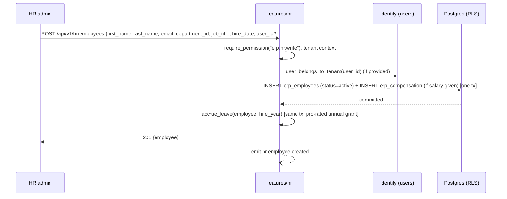
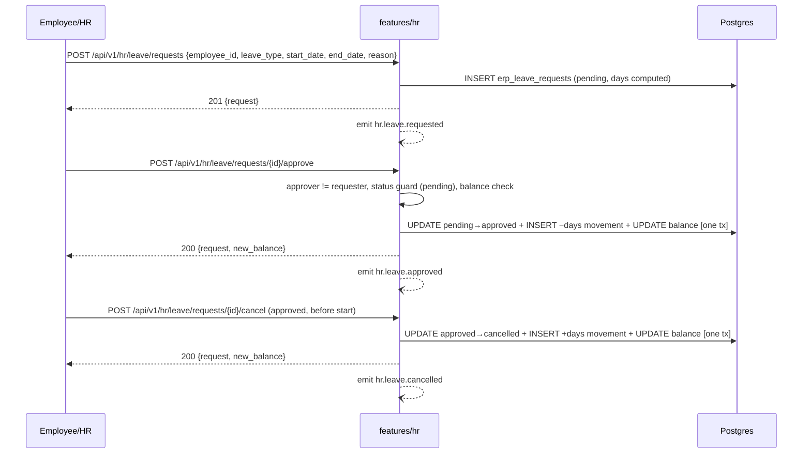
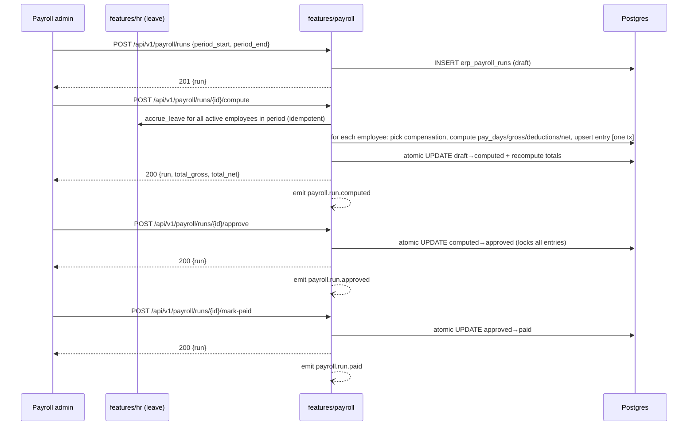

# Skyrict - HR & Payroll Module (ERP Phase 1)

## Status

Approved to build · **Module owner: Abhikrishna** · Phase-1 ERP module track (`docs/architecture/erp-phase1.md`). Builds on `services/core` (scaffolded by [ERP-FND-001]) and the identity permission/role wiring + BFF `CORE_SEGMENTS` routing from [ERP-FND-002] - both are dependencies, not assumptions.

## Audience

The whole Skyrict team (Swalih - Sales & CRM, Abinav - Inventory & Warehouse, Abhikrishna - HR & Payroll, Dennis - Finance & Accounting). Each owner builds their module end-to-end (database, backend, frontend). This document is written so that **the other three owners can understand the HR & Payroll module** - its shape, its rules, and exactly where it contracts with their modules - without reading the implementation.

This module follows the **same architecture as the rest of Skyrict**. Nothing here invents a new convention: it mirrors `services/identity`'s feature-based layout, the existing BFF proxy + API client patterns in `apps/web`, the RLS tenancy model, the event envelope from `libs/skyrict-events`, and the RFC 7807 / permission conventions already in the repo.

---

## 1. Overview - Why this module exists, and what it does

### 1.1 Why

The Skyrict Business Operating System is built on the "internal truth" pillar: _"A deliberately scoped ERP slice capturing what's actually happening inside your company… the ~20% of operations that 80% of SMBs actually use."_

**HR & Payroll is the people-and-compensation slice of that pillar.** It answers, in one tenant-scoped place:

- **Who** works for us, and where do they sit? (departments, employees)
- **Who** is out, and when? (leave requests + balances)
- **What** do we pay them, and what did we actually pay? (compensation, payroll runs)

It is deliberately **not** a full HRMS. Phase 1 covers the flow an SMB actually runs: hire an employee → track their leave → run payroll each period → pay.

### 1.2 Position in the architecture

HR & Payroll lives in **`services/core`** as two feature packages - **`features/hr`** (departments, employees, leave) and **`features/payroll`** (compensation, runs, entries, settings) - served to the browser through the same-origin BFF proxy in `apps/web`:

```
apps/web  ── same-origin /api/v1/* (BFF proxy) ──►  services/core
                                                      ├── features/hr       (departments, employees, leave)
                                                      ├── features/payroll  (compensation, runs, entries, settings)
                                                      └── features/payroll_automation  (batches, schedules, notifications — HR-AUT-001)
                                                      │    ↓ tenant context + RLS
                                                      └── Postgres (RLS)
```

Key architectural facts this module depends on:

- **Auth & tenancy are owned by `services/identity`.** HR & Payroll never mints tokens, never resolves tenants on its own. It trusts the verified access JWT and the tenant context set for the request. **Permissions are NOT a JWT claim** - they are resolved from the database at request time via `require_permission`.
- **Tenant isolation is enforced by PostgreSQL Row-Level Security**, plus a repository-layer `tenant_id` filter as defense in depth.
- **The browser never talks to the backend directly.** It goes through the same-origin BFF proxy (`apps/web/src/app/api/v1/[...path]/route.ts`) and the `apiFetch` client.

### 1.3 The core idea (the spine of this module)

- **Leave balance is a ledger, not a number.** You never "set the balance to 20". You record a movement (`+1 annual accrual`, `−3 approved leave`) and the balance is _derived_ from the movements. This makes leave balances verifiable against the request history.
- **Salary is effective-dated history, never overwritten.** A pay change inserts a new `erp_compensation` row with a new `effective_from`; the old row stays. Payroll reads the row that was effective on the period end.
- **Payroll entries are immutable once approved.** After a run is approved, no entry can be edited or deleted - only a whole-run `void` reopens the period.

### 1.4 Services used by HR & Payroll

| Service / lib         | How HR & Payroll uses it                                                                                                                                                                                                                                                               |
| --------------------- | -------------------------------------------------------------------------------------------------------------------------------------------------------------------------------------------------------------------------------------------------------------------------------------- |
| `services/core`       | The service the module lives in - own engine, `db/session.py` with the `after_begin` RLS hook, own Alembic migrations, `features/hr` + `features/payroll`                                                                                                                              |
| `services/identity`   | Access JWT verification (RS256, shared public key, issuer/audience), tenant resolution from slug (`X-Tenant-Slug` in dev/test), **DB-resolved permissions** via `require_permission` (roles → permissions), user records (`employee.user_id` linkage, validated but not created by HR) |
| `libs/skyrict-common` | `ResponseEnvelope` / `ListResponse` / `PaginationMeta` response wrappers, `PaginationParams` (offset/limit pagination), `SkyrictError` exception hierarchy (RFC 7807 mapping), `configure_logging`                                                                                     |
| `libs/skyrict-events` | `BaseEvent` envelope shape for all `hr.*` / `payroll.run.*` events (Phase 1: structlog-stub producers)                                                                                                                                                                                 |
| Postgres              | All `erp_*` tables, `current_tenant_id()` function + RLS policies, composite tenant FKs, partial unique indexes, `NUMERIC(18,4)` money columns                                                                                                                                         |
| Redis                 | Optional - rate limiting and any tenant slug → UUID cache (not required for HR & Payroll logic)                                                                                                                                                                                        |

### 1.5 Usage - who uses it, and the daily flows

| Actor                      | What they do in the module                                           |
| -------------------------- | -------------------------------------------------------------------- |
| HR admin                   | Creates/edits departments and employees, manages leave, reviews team |
| Manager                    | Sees their team, approves/rejects leave requests                     |
| Payroll admin              | Creates runs, computes, reviews entries, approves and marks paid     |
| Employee                   | Requests leave, views their own pay entries                          |
| Organization admin / owner | Sees everything, sets payroll settings, manages compensation         |

Daily flows (Phase 1):

1. **Hire** - an HR admin records a new employee (department, job title, hire date), optionally links them to an identity user, and records their starting compensation. Annual leave is accrued pro-rata from the hire date.
2. **Leave** - an employee is out; a request is raised, approved (deducting the balance atomically) or rejected. Approved leave can be cancelled before the start date (balance is restored).
3. **Payroll** - a payroll admin creates a run for a period, computes entries (prorated base salary, unpaid-leave deduction, recorded statutory rates), reviews, approves, and marks it paid.
4. **Reporting** - the reporting module (M-RPT) consumes this module's events and tables for headcount, leave usage, and payroll cost.

---

## 2. System Design

### 2.1 Service placement and folder structure

HR & Payroll is built as **two feature packages in `services/core`**: `features/hr` (departments, employees, leave) and `features/payroll` (compensation, runs, entries, settings). They are separated because they have different lifecycle rules and different permission families (`erp.hr.*` vs `erp.payroll.*`), even though payroll entries _reference_ employees.

The service mirrors `services/identity`'s feature-based layout:

```
services/core/
├── src/core/
│   ├── api/
│   │   ├── deps.py              # shared: get_tenant_context, get_current_user, require_permission
│   │   ├── lifespan.py
│   │   ├── middleware.py
│   │   ├── readiness.py
│   │   └── v1/
│   │       ├── router.py        # mounts feature routers at /api/v1
│   │       └── health.py
│   ├── core/
│   │   ├── config.py            # CORE_* env settings
│   │   ├── constants.py         # enums, problem URIs, defaults (CORE_DEFAULT_CURRENCY)
│   │   ├── exceptions.py        # RFC 7807 exceptions + status map
│   │   ├── permissions.py       # erp.hr.* / erp.payroll.* catalog for this service
│   │   ├── audit_events.py      # canonical action constants (hr.*, payroll.*)
│   │   ├── security.py          # JWT verification (identity-issued)
│   │   ├── telemetry.py
│   │   ├── tenant_context.py    # request-scoped tenant ContextVar
│   │   └── tenant_resolver.py   # X-Tenant-Slug → tenant UUID
│   ├── db/
│   │   ├── session.py           # async engine/session factory + after_begin RLS hook
│   │   └── repository.py        # SqlRepository base (tenant-scoped)
│   ├── domain/
│   │   ├── entities.py
│   │   └── value_objects.py     # Money (validated vs erp_currencies)
│   ├── events/
│   │   ├── consumers/
│   │   ├── handlers/
│   │   └── producers/
│   │       ├── hr_events.py
│   │       └── payroll_events.py
│   ├── features/
│   │   ├── hr/                  # ★ THIS MODULE - part 1
│   │   │   ├── router.py
│   │   │   ├── schemas.py
│   │   │   ├── service.py
│   │   │   ├── ports.py
│   │   │   ├── repository.py
│   │   │   └── models/          # erp_department, erp_employee, erp_leave_type,
│   │   │                        #   erp_leave_balance, erp_leave_request, erp_leave_movement
│   │   └── payroll/             # ★ THIS MODULE - part 2
│   │       ├── router.py
│   │       ├── schemas.py
│   │       ├── service.py
│   │       ├── ports.py
│   │       ├── repository.py
│   │       └── models/          # erp_compensation, erp_payroll_run,
│   │                            #   erp_payroll_entry, erp_payroll_settings
│   ├── models/                  # base.py only - shared Base + UUID/Timestamp mixins
│   │   └── base.py
│   ├── cli.py
│   ├── main.py
│   └── seed.py                   # reference data + per-tenant leave-type defaults
├── alembic/versions/             # 0001_initial (FND-001), 0002_inventory, 0003_crm_sales,
│                                 #   0004_finance, 0005_hr_payroll  (version_table = alembic_version_core)
├── tests/{unit,integration,factories}
├── Dockerfile
└── pyproject.toml
```

### 2.2 Layering contract (must hold)

```
api (router.py)  →  features/<module>/service.py  →  features/<module>/repository.py  →  models
                          │
                          └── events/producers  (emit after commit)
```

- Controllers (routers) are thin: parse request → call service → map to response schema.
- **Business rules live in the feature service** (§4). Validation of money, state-machine transitions, balance checks, compute logic - all here.
- **Repositories are the only code that touches SQLAlchemy models.** They own tenant scoping (`WHERE tenant_id = ctx.tenant_id`) and RLS-compatible queries.
- **No direct DB access from routers or event handlers.**
- Cross-feature calls **between `features/hr` and `features/payroll`** go through `ports.py` interfaces (e.g. payroll reads approved unpaid leave via `LeaveLedgerPort`). Neither feature imports the other's repository or models.
- Money is the shared `Money(amount: Decimal, currency: str)` value object - **never `float`**. Money columns are `NUMERIC(18, 4)`.

### 2.3 Multi-tenancy and RLS

Identical model to the rest of Skyrict:

1. Every `erp_*` table carries `tenant_id UUID NOT NULL`.
2. Every table has RLS **enabled** and a policy:

```sql
ALTER TABLE erp_employees ENABLE ROW LEVEL SECURITY;
CREATE POLICY erp_employees_tenant_isolation ON erp_employees
  USING (tenant_id = current_setting('app.current_tenant_id', true)::uuid);
```

3. The request pipeline sets the session variable once per request (the `after_begin` hook in `db/session.py` runs `SELECT set_config('app.current_tenant_id', $1, true)` - transaction-local).
4. The repository layer additionally filters by the tenant ContextVar. **RLS is the hard guarantee; the repository filter is defense in depth.**
5. Cross-tenant data is **unreachable**: a cross-tenant read returns zero rows, a cross-tenant write is blocked by the policy.

**RLS + composite FKs.** All FK pairs between tenant-scoped tables include `tenant_id`:

```sql
CONSTRAINT fk_erp_payroll_entries_employee
  FOREIGN KEY (tenant_id, employee_id) REFERENCES erp_employees (tenant_id, id)
```

Applied to every tenant-to-tenant FK: `erp_leave_requests → erp_employees`, `erp_leave_movements → erp_employees`, `erp_leave_balances → erp_employees`, `erp_compensation → erp_employees`, `erp_payroll_entries → erp_payroll_runs` and `→ erp_employees`, and the self-FK `erp_departments.manager_employee_id → erp_employees`.

### 2.4 Authentication and authorization

- `services/core` verifies the **identity-issued access JWT** (RS256, shared public key, same issuer/audience). It never issues tokens.
- **Permissions are resolved from the database at request time**, not from a JWT claim. `require_permission("erp.hr.read")` resolves the user's roles → permissions on every request, fail-closed.
- `employee.user_id` (the optional identity-user link) is validated against the routed tenant through an injected port; HR stores only the UUID and never creates identity users.

> **Accepted Phase-1 deviation (recorded, not incidental):** the concrete
> identity validator is not wired in Phase 1. The composition root
> (`services/core/src/core/api/deps.py::get_employee_service`) injects
> `_NoopIdentityUserPort`, which **fails open** - it logs a warning
> (`identity.validate_user_noop`) and accepts the `user_id` as-is, so
> `POST /hr/employees` works without an identity round-trip. Consequences:
> a hire may reference a user id that does not exist or belongs to another
> tenant until the identity-integration ticket lands. The swap point is
> intentionally the one composition-root line above; no test asserts the
> no-op, and the security matrix's "validated" row for `user_id` is green
> **only** under this deviation.

- **Two permission families**:

| Key                      | Meaning                                                                                      |
| ------------------------ | -------------------------------------------------------------------------------------------- |
| `erp.hr.read`            | View departments, employees, leave requests, balances, movements                             |
| `erp.hr.write`           | Create/edit departments, employees, leave requests; manual balance adjustments; accrue leave |
| `erp.hr.approve`         | Approve/reject/cancel leave requests                                                         |
| `erp.payroll.read`       | View compensation, payroll runs, entries, settings                                           |
| `erp.payroll.write`      | Create runs, compute, edit draft entries, update settings, record compensation               |
| `erp.payroll.approve`    | Approve, void, or mark-paid a payroll run                                                    |
| `erp.payroll.ai.read`    | View automation batches, schedules, notifications, digests (HR-AUT-001)                      |
| `erp.payroll.ai.run`     | Enqueue batches, manual tick, create/update/delete schedules (HR-AUT-001)                    |
| `erp.payroll.ai.notify`  | Read/update own notification delivery preferences (HR-AUT-001)                               |
| `erp.payroll.ai.approve` | Reserved for automated run-approval actions (HR-AUT-001; not yet wired)                      |

- **Where these keys are registered:** [ERP-FND-002] (SKY-39) extends `services/identity/src/identity/core/permissions.py` - constants + `CATALOG` + `PERMISSION_MODULES` (the module docstring: _"A permission must be added here AND via migration before it can be assigned to roles"_) - with the full Phase-1 ERP catalog via a new identity Alembic migration inserting the keys (`ON CONFLICT (key) DO NOTHING`) and updating `identity/core/constants.py` `SYSTEM_ROLE_DEFINITIONS`. This module consumes the catalog; it does not add its own identity migration (single ownership point, see finance-accounting.md:117):

| Role                 | HR & Payroll grants (added to existing)           |
| -------------------- | ------------------------------------------------- |
| `tenant_owner`       | `*` (already full access)                         |
| `organization_admin` | all six keys                                      |
| `department_manager` | `erp.hr.read`, `erp.hr.write`, `erp.payroll.read` |
| `standard_user`      | `erp.hr.read`                                     |
| `auditor`            | `erp.hr.read`, `erp.payroll.read`                 |

The **payroll automation** keys (`erp.payroll.ai.*`, HR-AUT-001) are
registered in the same catalog plus a dedicated `payroll_ai` module
(`services/core/src/core/core/permissions.py` → `PERMISSION_MODULES`),
seeded to the identity side like the core six keys above.

### 2.5 Events

Use the envelope from `libs/skyrict-events` (`src/skyrict_events/base.py`): `{event_id, event_type, timestamp, tenant_id, version, correlation_id, metadata}`, topic convention **`{domain}.{entity}.{action}`**.

**Phase-1 policy:** emit events **after commit**; Kafka is deferred - producers are structlog stubs keyed by tenant. When Kafka wiring lands, the same helper becomes a `BaseProducer.publish(...)` call with no call-site change.

Events this module emits:

| Topic                    | Emitted when                                                                                          | Payload highlights                                               |
| ------------------------ | ----------------------------------------------------------------------------------------------------- | ---------------------------------------------------------------- |
| `hr.department.created`  | department inserted                                                                                   | department_id, name                                              |
| `hr.employee.created`    | employee inserted                                                                                     | employee_id, employee_number, department_id, status              |
| `hr.employee.onboarded`  | same transaction as `.created` (alias; reserved by erp-phase1.md for payroll eligibility + reporting) | employee_id, hire_date, department_id                            |
| `hr.employee.updated`    | employee edited                                                                                       | employee_id, changed fields                                      |
| `hr.employee.terminated` | terminate transition                                                                                  | employee_id, termination_date                                    |
| `hr.leave.requested`     | request inserted                                                                                      | request_id, employee_id, leave_type, days                        |
| `hr.leave.approved`      | approval committed                                                                                    | request_id, employee_id, leave_type, days                        |
| `hr.leave.rejected`      | rejection committed                                                                                   | request_id, employee_id, reason                                  |
| `hr.leave.cancelled`     | cancellation committed                                                                                | request_id, employee_id, leave_type, days                        |
| `payroll.run.computed`   | compute committed                                                                                     | run_id, period_start, period_end, total_gross, total_net         |
| `payroll.run.approved`   | approval committed                                                                                    | run_id, total_net, entry_count                                   |
| `payroll.run.paid`       | mark-paid committed                                                                                   | run_id, total_net, paid_at, je_bridge_status, je_bridge_entry_id |
| `payroll.run.voided`     | void committed                                                                                        | run_id, reason                                                   |

Producer sketch:

```python
# src/core/events/producers/hr_events.py
import structlog

logger = structlog.get_logger("core.events.hr")


async def emit_leave_approved(
    *, request_id: str, employee_id: str, leave_type: str, days: int, tenant_id: str,
) -> None:
    logger.info(
        "event.hr.leave.approved",
        request_id=request_id, employee_id=employee_id,
        leave_type=leave_type, days=days, tenant_id=tenant_id,
    )
```

### 2.6 Errors, pagination, idempotency

- **Errors:** RFC 7807 `application/problem+json` via `core/exceptions.py` (mirrors identity). Service raises domain exceptions (`skyrict_common.exceptions` subclasses + module exceptions below); the API layer maps them via `_STATUS_MAP`.
- **Pagination:** **offset/limit** using `PaginationParams(page=1, page_size=20)` from `skyrict-common`, responses wrapped in `ResponseEnvelope` / `ListResponse` with `PaginationMeta`.
- **Idempotency:** the codebase has **no `Idempotency-Key` pattern** - use naturally idempotent writes. State-machine transitions are atomic conditional UPDATEs (`WHERE status = ...`), so concurrent duplicate approve/compute/void requests can never double-fire. Balance mutations are guarded increments within a single transaction.

---

## 3. Database Design

### 3.1 ERD

```mermaid
erDiagram
    ERP_DEPARTMENTS ||--o{ ERP_EMPLOYEES : "employs"
    ERP_DEPARTMENTS ||--o| ERP_DEPARTMENTS : "manager is employee"
    ERP_EMPLOYEES ||--o{ ERP_LEAVE_REQUESTS : "raises"
    ERP_EMPLOYEES ||--o{ ERP_LEAVE_BALANCES : "holds"
    ERP_EMPLOYEES ||--o{ ERP_LEAVE_MOVEMENTS : "has ledger"
    ERP_EMPLOYEES ||--o{ ERP_COMPENSATION : "has history"
    ERP_EMPLOYEES ||--o{ ERP_PAYROLL_ENTRIES : "paid in"
    ERP_PAYROLL_RUNS ||--o{ ERP_PAYROLL_ENTRIES : "contains"

    ERP_DEPARTMENTS {
        uuid id PK
        uuid tenant_id FK
        string name "unique per tenant"
        uuid manager_employee_id "self-FK, nullable"
        boolean is_active
        timestamptz created_at
        timestamptz updated_at
    }
    ERP_EMPLOYEES {
        uuid id PK
        uuid tenant_id FK
        string employee_number "EMP-{seq}, unique per tenant"
        string first_name
        string last_name
        string email "nullable"
        string phone "nullable"
        uuid user_id "identity user link, nullable"
        uuid department_id "FK, nullable"
        string job_title
        string employment_status "active|on_leave|terminated"
        date hire_date
        date termination_date "nullable"
        timestamptz created_at
        timestamptz updated_at
    }
    ERP_LEAVE_TYPES {
        uuid id PK
        uuid tenant_id FK
        string code "annual|sick|unpaid|casual|..."
        string name
        boolean is_accrual "annual=true, sick/unpaid=false"
        int accrual_days_per_year "nullable, accrual types only"
        timestamptz created_at
        timestamptz updated_at
    }
    ERP_LEAVE_REQUESTS {
        uuid id PK
        uuid tenant_id FK
        uuid employee_id FK "composite"
        string leave_type "enum, one of erp_leave_types"
        date start_date
        date end_date
        int days "derived: end - start + 1"
        string status "pending|approved|rejected|cancelled"
        string reason "nullable"
        uuid approved_by "identity user, nullable"
        timestamptz approved_at "nullable"
        timestamptz created_at
        timestamptz updated_at
    }
    ERP_LEAVE_MOVEMENTS {
        uuid id PK
        uuid tenant_id FK
        uuid employee_id FK "composite"
        string leave_type "enum"
        int qty "signed, != 0"
        string ref_type "annual_accrual|leave_request|manual_adjustment"
        uuid ref_id "nullable"
        string reason "nullable, required for manual_adjustment"
        timestamptz occurred_at
    }
    ERP_LEAVE_BALANCES {
        uuid id PK
        uuid tenant_id FK
        uuid employee_id FK "composite"
        string leave_type "enum, accrual types only"
        int balance "derived, >= 0"
        timestamptz created_at
        timestamptz updated_at
    }
    ERP_COMPENSATION {
        uuid id PK
        uuid tenant_id FK
        uuid employee_id FK "composite"
        date effective_from
        decimal monthly_salary "NUMERIC(18,4), Money"
        string currency
        boolean is_active
        timestamptz created_at
        timestamptz updated_at
    }
    ERP_PAYROLL_RUNS {
        uuid id PK
        uuid tenant_id FK
        string run_code "PR-{yyyy}-{mm}"
        date period_start
        date period_end
        string status "draft|computed|approved|paid|void"
        decimal total_gross "NUMERIC(18,4), projection"
        decimal total_net "NUMERIC(18,4), projection"
        uuid computed_by "identity user"
        uuid approved_by "identity user"
        uuid paid_by "identity user"
        timestamptz computed_at
        timestamptz approved_at
        timestamptz paid_at
        string void_reason "nullable"
        string je_bridge_status "none|pending|draft"
        timestamptz created_at
        timestamptz updated_at
    }
    ERP_PAYROLL_ENTRIES {
        uuid id PK
        uuid tenant_id FK
        uuid run_id FK "composite"
        uuid employee_id FK "composite"
        decimal base_salary "snapshot at period end"
        int pay_days "calendar days paid in period"
        decimal gross "NUMERIC(18,4)"
        decimal deductions "NUMERIC(18,4)"
        decimal net "NUMERIC(18,4)"
        jsonb adjustments "manual overrides on draft/computed"
        timestamptz created_at
    }
    ERP_PAYROLL_SETTINGS {
        uuid id PK
        uuid tenant_id FK "single row per tenant"
        string default_currency
        decimal pf_rate "recorded statutory %"
        decimal tax_rate "recorded statutory %"
        string rounding "nearest|up|down"
        boolean ai_automation_enabled "HR-AUT-001"
        boolean je_bridge_enabled "Commit 4"
        timestamptz created_at
        timestamptz updated_at
    }
```



### 3.2 Table-by-table contract

All tables: `id UUID PRIMARY KEY`, `tenant_id UUID NOT NULL`, RLS enabled with a tenant policy, `created_at TIMESTAMPTZ NOT NULL DEFAULT now()` (and `updated_at` where mutable). All money columns are `NUMERIC(18, 4)`. `erp_leave_movements` and `erp_payroll_entries` have **no `updated_at`** (immutable records).

**`erp_departments`** - organizational units.

- `name` - unique `(tenant_id, name)` named `uq_erp_departments_tenant_name`
- `manager_employee_id UUID NULL` - self-FK composite `(tenant_id, manager_employee_id) → erp_employees(tenant_id, id)`; nullable (a department can exist before a manager is set)
- `is_active BOOLEAN NOT NULL DEFAULT true` - soft-disable (never hard-delete)
- Indexes: `(tenant_id, name)` (unique)

**`erp_employees`** - the people records.

- `employee_number` - auto-generated `EMP-{seq}` per tenant; unique `(tenant_id, employee_number)` named `uq_erp_employees_tenant_number`
- `department_id UUID NULL` - composite FK `→ erp_departments(tenant_id, id)`; nullable (small orgs may have no departments)
- `user_id UUID NULL` - identity user UUID; **no FK possible** (identity lives in another service's database); validated via a port
- `employment_status` - enum `active | on_leave | terminated` (native enum `erp_employment_status`). This is the single source of employment truth - there is deliberately **no separate `is_active` flag** on employees
- `termination_date DATE NULL` - set on terminate; required when status = `terminated`
- Indexes: `(tenant_id, employment_status)`, `(tenant_id, department_id)`, `(tenant_id, employee_number)` (unique)

**`erp_leave_types`** - **tenant-scoped** leave catalogue (not a global reference: accrual policy is a per-tenant decision). Seeded per tenant with defaults `annual` (is_accrual=true, 20 days), `sick` (false), `unpaid` (false); tenants may add more (casual, marital, bereavement).

- `code` - unique `(tenant_id, code)` named `uq_erp_leave_types_tenant_code`
- `is_accrual BOOLEAN` - accrual types get balance rows and are balance-capped; non-accrual types are tracked via movements only and never get balance rows (they are never capped)
- `accrual_days_per_year INT NULL` - accrual types only
- **Design note:** there is no per-type `allow_negative` flag. The rule is fixed and simple: _accrual balances can never go negative (service + DB CHECK); non-accrual types have no balance_. This keeps the `CHECK` constraint sound.

**`erp_leave_requests`** - leave requests and their approval state.

- `leave_type` - enum referencing `erp_leave_types.code`
- `days` - derived `end_date − start_date + 1`, computed server-side (never trusted from the client)
- `status` - enum `pending | approved | rejected | cancelled` (state machine in §3.3)
- `approved_by UUID NULL` - identity user who approved/rejected; cannot equal the requesting employee (no self-approval, §4.6)
- Indexes: `(tenant_id, status)`, `(tenant_id, employee_id)`

**`erp_leave_movements`** - **the ledger** (the most important table).

- `qty INT` - signed delta (`+` accrued/refunded, `−` approved/used). Must be `!= 0` (service-enforced)
- `ref_type` - `annual_accrual | leave_request | manual_adjustment`
- `reason` - **required for `manual_adjustment`** (service-enforced)
- **Movements are immutable.** No UPDATE, no DELETE - never exposed via update/delete endpoints and no such repository methods.

**`erp_leave_balances`** - the materialized current balance (a read optimization).

- `UNIQUE (tenant_id, employee_id, leave_type)` named `uq_erp_leave_balances_employee_type`
- `CHECK (balance >= 0)` named `ck_erp_leave_balances_non_negative` - the DB backup for Rule 2
- Only rows for **accrual** leave types exist. The source of truth is `erp_leave_movements`; balances are recomputed on write (§4.1).

**`erp_compensation`** - effective-dated salary history.

- `monthly_salary NUMERIC(18,4)` + `currency` - `Money`
- `effective_from DATE` - the row effective at or before period end is used by payroll
- `is_active BOOLEAN NOT NULL DEFAULT true` - soft-disable a row (corrections) without deleting history
- `UNIQUE (tenant_id, employee_id, effective_from)` named `uq_erp_compensation_employee_effective`
- Indexes: `(tenant_id, employee_id, is_active)`

**`erp_payroll_runs`** - a payroll period and its lifecycle.

- `run_code` — `PR-{yyyy}-{mm}`, unique `(tenant_id, run_code)`
- `status` — enum `draft | computed | approved | paid | void` (state machine in §3.3)
- `total_gross` / `total_net` — cached projections, recomputed server-side on every compute; never written by clients
- `je_bridge_status` — `String(16)` `none | pending | draft` (`CHECK ck_erp_payroll_runs_je_bridge_status_ok`), **not** a native pg enum so the FIN-AI-001 orchestrator can add states without a migration. Written only by the mark-paid JE bridge (§4.10). `pending` means the run was paid while the finance chart of accounts was incomplete — same root cause as `docs/backlog/finance-chart-of-accounts-gap.md`, surfaced on the run for the payroll admin (and on the JE entry in Finance once it exists).
- `run_code` - `PR-{yyyy}-{mm}`, unique `(tenant_id, run_code)`
- `status` - enum `draft | computed | approved | paid | void` (state machine in §3.3)
- `total_gross` / `total_net` - cached projections, recomputed server-side on every compute; never written by clients
- **Period uniqueness:** partial unique index

```sql
CREATE UNIQUE INDEX uq_erp_payroll_runs_period_active
  ON erp_payroll_runs (tenant_id, period_start, period_end)
  WHERE status <> 'void';
```

A voided run keeps its row for audit but does **not** block a fresh run for the same period.

- Indexes: `(tenant_id, status)`, `(tenant_id, period_start, period_end)` (partial unique above)

**`erp_payroll_entries`** - per run per employee.

- `run_id` - composite FK `(tenant_id, run_id) → erp_payroll_runs(tenant_id, id)`
- `employee_id` - composite FK `(tenant_id, employee_id) → erp_employees(tenant_id, id)`
- `base_salary` - snapshot of the compensation effective at period end (stable even if compensation later changes)
- `adjustments JSONB` - manual per-entry overrides applied while the run is `draft`/`computed` (e.g. bonus, arrears). Stored as `{"earnings": {...}, "deductions": {...}}`
- **Immutable once the run is approved** - no update/delete endpoints or repository methods for entries in approved+ runs
- `UNIQUE (tenant_id, run_id, employee_id)` named `uq_erp_payroll_entries_run_employee`
- Indexes: `(tenant_id, run_id)`

**`erp_payroll_settings`** - single row per tenant.

- Enforce one row per tenant: `UNIQUE (tenant_id)` named `uq_erp_payroll_settings_tenant` (or a fixed `tenant_id` PK)
- `pf_rate` / `tax_rate` — recorded statutory percentages applied at compute time (a **recorded** rate, not a tax engine)
- `rounding` — enum `nearest | up | down` applied to `net`
- `ai_automation_enabled BOOLEAN NOT NULL DEFAULT true` — per-tenant master switch for the HR-AUT-001 automation layer (`features/payroll_automation`). Env-var flag explicitly rejected (a single global env var cannot express per-tenant decisions).
- `je_bridge_enabled BOOLEAN NOT NULL DEFAULT true` — per-tenant master switch for the payroll→Finance accrual JE bridge (§4.10). Default `true`; an org that wants to record salary accruals manually turns it off. Same shape as `ai_automation_enabled`.
- `pf_rate` / `tax_rate` - recorded statutory percentages applied at compute time (a **recorded** rate, not a tax engine)
- `rounding` - enum `nearest | up | down` applied to `net`

### 3.3 State machines

```
Leave request:  pending ──► approved
                  │  │
                  │  └─────► rejected
                  │
                  └────────► cancelled        (by requester or manager, before start)

                approved ──► cancelled        (reverses the balance deduction)

Employee:       active ◄──► on_leave
                  │
                  └───► terminated            (terminal; requires termination_date)

Payroll run:    draft ──► computed ──► approved ──► paid
                  │          │             │
                  └──────────┴─────────────┴──► void   (from any pre-paid state)
```

Transition rules (enforced in the service, with **atomic guards** in the repository):

- Leave request: one transition per call. `approved` and `rejected` only from `pending`; `cancelled` from `pending` **or** `approved` (pre-start date). Approval checks balance (§4.3); cancellation of an approved request writes a reversal movement (§4.5).
- Employee: `active ⇄ on_leave` (via `POST /hr/employees/{id}/status`); `active → terminated` is terminal (a terminated employee cannot be re-activated or re-hired via this endpoint - a new employee record is required). Leave requests and payroll runs cannot be created for terminated employees after `termination_date`.
- Payroll run: each transition is a conditional UPDATE (`WHERE status = 'draft'`, etc.), so concurrent computes/approves/voids can only win once. `void` keeps the row, archives entries as read-only, and frees the period for a new `draft` run.

### 3.4 Migrations

Alembic under `services/core/alembic/`. Migration **`0005_hr_payroll`** (after `0001_initial` base/RPC/RLS scaffolding from FND-001, `0002_inventory`, `0003_crm_sales`, `0004_finance`). `version_table = alembic_version_core` (matches finance-accounting.md:584 - identity uses the default `alembic_version` and must not collide):

1. Create the 10 tables (§3.2).
2. Create enums: `erp_employment_status`, `erp_leave_request_status`, `erp_payroll_run_status`, `erp_payroll_rounding` (`create_type=False`; migrations own type creation).
3. Create composite-FK constraints (tenant-scoped).
4. Create indexes, including the partial unique index on `erp_payroll_runs`.
5. `ENABLE ROW LEVEL SECURITY` + create tenant-isolation policies on all 10 tables.
6. Seed nothing tenant-specific here (leave types are seeded at tenant provisioning - see `core/seed.py`). Reference data (currencies via `0001`) is already global.
7. Downgrade drops policies first, then tables (reverse order), then enums.

Commits 1–3 picked up the base schema via `0026`→`0033` (payroll settings `ai_automation_enabled`, compensation/employee tweaks, payroll automation tables; dev's `0026_finance_automation` sits in front of `0031`–`0035` after the merge renumber). Commit 4 — **`0034_payroll_accrual_je_bridge`** (revision `0034`, `down_revision 0033`) — takes the payroll settings `default true` columns/flags path: adds `erp_payroll_runs.je_bridge_status` (+ CHECK) and `erp_payroll_settings.je_bridge_enabled` server-defaults. One migration, same shape the older flag tickets used; validated by the integration suite running `alembic upgrade head`.

Reference data (`src/core/seed.py`): leave-type defaults per tenant (`annual`/`sick`/`unpaid`), payroll settings default row (currency from `CORE_DEFAULT_CURRENCY`, zero rates), `EMP-`/`PR-` numbering seeds.

---

## 4. Business rules (the heart of the module)

All rules are implemented in the **service layer** (`features/hr/service.py`, `features/payroll/service.py`). They execute inside a single DB transaction.

### 4.1 Rule 1 - Leave balance is a ledger

1. Every change to a leave balance writes exactly one `erp_leave_movements` row.
2. After the movement row is written, `balance` is **recomputed** on the affected `erp_leave_balances` row: `balance = balance + movement.qty` (signed).
3. If no balance row exists for `(employee, leave_type)`, create one in the same transaction (seeded from the movement). Only **accrual** leave types get balance rows.
4. Read endpoints always return the stored `balance` (the recomputed value).

### 4.2 Rule 2 - No negative accrual balance

1. **Service check:** before writing a negative movement for an accrual type, verify `current_balance + qty >= 0`. If it would go negative → raise `LeaveBalanceExceededError` (422).
2. **DB backup:** `CHECK (balance >= 0)` (§3.2) rejects any violating write.
3. Non-accrual types (sick, unpaid) have no balance rows and are never capped.
4. Applies to leave approval, cancellation reversal, and manual adjustment (when negative).

### 4.3 Rule 3 - Leave approval is atomic

1. `approve_leave_request` validates the request is `pending`, the approver ≠ the requester, and the employee is not terminated.
2. In **one transaction**: flip status `pending → approved` (atomic guard `WHERE status = 'pending'`) → write a `−days` movement (`ref_type=leave_request`) → recompute the balance → set `approved_by`/`approved_at`.
3. If the balance would go negative (§4.2), the **entire transaction rolls back** - the request stays `pending`.
4. Rejection writes no movement (nothing was deducted) and flips `pending → rejected` atomically.

5. **Resolved - concurrent-approval race (HR-BE-002):** the single-request
   atomicity above originally did **not** extend across two concurrent
   approvals on _different_ requests for the _same_ employee: both could read
   the same pre-approval balance, both pass the §4.2 check, and both write a
   materialized `erp_leave_balances` row based only on their own transaction's
   view - the ledger could go negative while the materialized balance still
   read `>= 0` and `ck_erp_leave_balances_non_negative` could not see it. This
   was **discovered, not designed**, and was a live correctness bug in the
   leave-balance write path. **Fix:** every balance-mutating path now takes a
   row lock on `erp_leave_balances (tenant_id, employee_id, leave_type)` before
   reading/rechecking the balance. `HrRepository.lock_leave_balance`
   (`services/core/src/core/features/hr/repository.py:502`) first seeds the
   row (`INSERT ... ON CONFLICT DO NOTHING` on
   `uq_erp_leave_balances_employee_type`, so a not-yet-created balance is still
   locked - `SELECT ... FOR UPDATE` alone would lock nothing on a missing row)
   and is then re-probed with a **fresh** recompute, never the pre-lock value.
   `approve_leave_request` locks before its §4.2 check
   (`hr/service.py:521`), cancellation of an approved request locks before its
   reversal (`hr/service.py:663`), and the accrual path locks in
   `accrue_leave_movement` (`hr/repository.py:518`). Multi-row callers - payroll
   `compute_run`'s accrual loop (`payroll/service.py:308`) - acquire locks in a
   stable deterministic order (`list_active_employees` sorts by
   `employee_number`, `payroll/repository.py:647`) to avoid deadlock; this
   ordering contract is documented at the call site. Regression coverage:
   `test_concurrent_approve_cross_requests_invariant` passes deterministically
   (no longer `xfail`), plus `..._stress_balance_exact`,
   `test_concurrent_compute_with_approval_no_deadlock`, and
   `test_concurrent_first_grant_single_movement` in
   `services/core/tests/integration/api/test_concurrency_atomicity.py`.

### 4.4 Rule 4 - Leave accrual is explicit and idempotent

1. Annual leave accrues per calendar year (`accrual_days_per_year` on the leave type).
2. `accrue_leave(employee_id, leave_year)` is **idempotent per `(employee, leave_type, leave_year)`** (probe: if an `annual_accrual` movement with `ref_id = leave_year` already exists, do nothing).
3. Grant: on the hire year, pro-rated `round(accrual_days × remaining_calendar_days / 365)`; on every full year (Jan 1), the full `accrual_days`.
4. Invoked automatically at the start of a payroll `compute` (for all active employees in the period) **and** via `POST /api/v1/hr/leave/balances/accrue` (hr.write) for manual/backfill use.
5. Never write on a read endpoint.

### 4.5 Rule 5 - Cancelling approved leave reverses the deduction

1. `cancel_leave_request` (from `approved`, before `start_date`) writes a `+days` reversal movement (`ref_type=leave_request`) and recomputes the balance - one transaction with the atomic `approved → cancelled` guard.
2. Reversal never takes the balance negative for the _reason_ of the reversal itself (it only ever adds back what was deducted); §4.2 still applies to any _other_ negative movement in the same transaction (none here).
3. Cancelling a `pending` request writes no movement.

### 4.6 Rule 6 - No self-approval

The actor calling `approve`/`reject` must not be the requesting employee (approver ≠ requester). This is checked against the identity user id on the request. (Manager-approves-own-leave is a team-decision item - see §12; default = blocked.)

### 4.7 Rule 7 - Salary is effective-dated history

1. Every pay change inserts a **new** `erp_compensation` row (`effective_from`, `monthly_salary`, `currency`). Existing rows are never updated for the amount - only `is_active` may flip for corrections.
2. Payroll uses the row that is `is_active = true` with the latest `effective_from <= period_end`.
3. Overlapping `effective_from` values are allowed (retroactive corrections); the latest-wins rule keeps it deterministic.

### 4.8 Rule 8 - Payroll entries are immutable once approved

1. Entries are editable only while the run is `draft` or `computed` (via `adjustments`).
2. `approve` locks every entry in the run (atomic `computed → approved` guard); after approval no entry can be updated, patched, or deleted.
3. To fix a mistake: `void` the whole run (archives entries read-only), then create a fresh `draft` run for the same period (§3.3). Partial edits to an approved run are impossible.

### 4.9 Rule 9 - Payroll compute is deterministic and idempotent per run

For each active (non-terminated, or terminated on/after period start) employee with an effective compensation row on `period_end`:

- `pay_days` = days in period, minus:
    - days after `termination_date` (pay through termination_date **inclusive**),
    - days before `hire_date` (new hires prorated from hire date),
    - calendar days covered by **approved `unpaid`** leave overlapping the period (`max(0, min(end, period_end) − max(start, period_start) + 1)`).
    - `sick` and `annual` (paid) leave do **not** reduce pay.
- `gross = monthly_salary × pay_days / days_in_period` (calendar-day proration; a stated Phase-1 approximation for monthly salaries over calendar-month runs - §12).
- `deductions = (pf_rate + tax_rate) × gross` from `erp_payroll_settings` + any manual `adjustments.deductions`.
- `net = gross − deductions` (rounded per settings).
- Run totals recomputed from entries. Re-running `compute` on the same run overwrites its `draft`/`computed` entries (idempotent); employees without effective compensation are skipped and recorded on the run.

### 4.10 Rule 10 — Payroll→Finance accrual JE bridge (FIN-AI-001 seam, Commit 4)

When `mark_paid` transitions a run `approved → paid`, and `je_bridge_enabled` is true and `total_gross > 0`, the run drafts a **salary accrual journal entry** in Finance through the `PayrollAccrualPort` (implemented in-process by `features/finance`; a worker/scheduler construction passes `finance=None` and skips the bridge — the API always wires Finance):

- **Entry shape** — source `payroll`, `source_ref = str(run_id)`, status `DRAFT`, dated at the `paid_at` moment:
    - DR `5010` (Salaries Expense) = gross
    - CR `2010` (Accrued Salaries) = net
    - CR `2020` (Salary Deductions Payable) = `gross − net`, **only when `deductions > 0`** (`ck_erp_journal_lines_amount_nonzero` rejects a `0.00` line, so zero-deduction runs skip it)
- **Outcome → run status:** `missing_accounts` → `je_bridge_status = pending` (finance chart incomplete — ties to `finance-chart-of-accounts-gap.md`); created **or** already-booked (idempotent `ConflictError` on `UNIQUE (tenant_id, source, source_ref)`) → `draft`; anything else → `none`. Always succeeds — mark-paid never fails on the bridge; the run records the truth instead.
- **Guards:** only on `paid` (not on recompute/void); runs voided after payment leave the entry for the Finance owner to handle.
- **Readable everywhere:** `GET /payroll/runs/{id}` returns `je_bridge_status`; `GET /payroll/runs/{id}/payslips` returns per-employee gross/deductions/net; the Finance owner sees the DRAFT entry in the journal-entries inbox. `erp.payroll.ai.approve` stays reserved for automated approvals; the bridge is a synchronous seam, not the automation path.

---

## 5. Flows

### 5.1 Hire



### 5.2 Leave lifecycle



### 5.3 Payroll run lifecycle



---

## 6. Backend Implementation Guide

### 6.1 Shared prerequisites (from `services/core`, delivered by [ERP-FND-001])

[ERP-FND-001] scaffolds `services/core` and provides: `core/config.py` (`CORE_` settings: `DATABASE_URL`, `JWT_PUBLIC_KEY`, `JWT_ISSUER`, `CORE_DEFAULT_CURRENCY=USD`, `CORE_PAYROLL_ROUNDING=nearest`), `core/security.py` (identity JWT verification), `core/tenant_resolver.py` + `core/tenant_context.py`, `api/deps.py` (`get_tenant_context`, `get_current_user`, `require_permission`), `db/session.py` + `models/base.py` (engine + `after_begin` RLS hook + mixins), `domain/value_objects.py` (**`Money`**), `core/permissions.py` and `core/audit_events.py`. Verify with: `uv run ruff check services/core`, a `require_permission("erp.hr.read")`-protected endpoint returning 401 without token, 403 without the permission, 200 with it. **Do not start Step 1 until FND-001 is merged** - the migration below is `0005`, sequenced after `0001_initial`.

### Step 1 - Models + migration

Write the 10 models under `features/hr/models/` and `features/payroll/models/` per §3.2 (one file per table). Then `alembic revision` → `0005_hr_payroll` implementing §3.4. **Verify the hard part:** run the two-tenant integration assertions (§9) against the migration - RLS must block cross-tenant writes and silently filter cross-tenant reads.

### Step 2 - `features/hr`

- `features/hr/schemas.py` - `DepartmentCreate/Update/Out`, `EmployeeCreate/Update/Out`, `TerminateRequest`, `LeaveRequestCreate/Out`, `LeaveApproveRejectBody`, `LeaveBalanceOut`, `LeaveMovementOut`, `BalanceAdjustmentCreate`, `AccrueBody`, list envelopes.
- `features/hr/repository.py` - tenant-filtered CRUD + scope filter (§9.2) + the atomic transitions (§4.3, §4.5) + ledger probes + balance recompute.
- `features/hr/service.py` - rules 1–6, accrual (§4.4), state machines, events after commit.
- `features/hr/ports.py` - `IdentityUserPort` (user validation against identity).
- `features/hr/router.py` - endpoints (§7); `require_permission("erp.hr.*")` module-level singletons.

### Step 3 - `features/payroll`

- `features/payroll/schemas.py` - `PayrollRunCreate/Out`, `ComputeResultOut`, `PayrollEntryOut`, `EntryAdjustmentIn`, `CompensationCreate/Out`, `PayrollSettingsIn/Out`, list envelopes.
- `features/payroll/repository.py` - run CRUD + atomic transitions, entry upsert, compensation effective-date pick, settings single-row read/upsert.
- `features/payroll/service.py` - rules 7–9, compute engine, `void`/re-run semantics.
- `features/payroll/ports.py` - `LeaveLedgerPort` (read approved unpaid days per employee in a period - implemented by `features/hr`).
- `features/payroll/router.py` - endpoints (§7); `require_permission("erp.payroll.*")`.
- **Composition:** `api/deps.py` injects `LeaveLedgerPort` (from `features/hr`, in-process) and the `IdentityUserPort` implementation.

### Step 4 - Events + audit

- `events/producers/hr_events.py` + `payroll_events.py` per §2.5. Emit **after commit** (in the service after the repository returns).
- `core/audit_events.py` - canonical actions: `hr.department.created`, `hr.department.updated`, `hr.employee.created`, `hr.employee.updated`, `hr.employee.terminated`, `hr.leave.requested`, `hr.leave.approved`, `hr.leave.rejected`, `hr.leave.cancelled`, `hr.leave.balance.adjusted`, `hr.leave.accrued`, `payroll.run.created`, `payroll.run.computed`, `payroll.run.approved`, `payroll.run.paid`, `payroll.run.voided`, `payroll.entry.adjusted`, `payroll.settings.updated`.
- Every mutation calls the shared audit service:

```python
await self.audit_service.log(
    action=HR_LEAVE_APPROVED,            # from core/audit_events.py
    target=f"leave_request:{request_id}",
    user_id=str(actor_user_id),
    tenant_id=str(tenant_id),
    ip_address=ip_address, user_agent=user_agent,
)
```

### Step 5 - Tests

See §9. Unit tests use fake port doubles; integration tests run against real Postgres + alembic.

---

## 7. API Reference

Base path `/api/v1`. Every endpoint: requires a valid identity access JWT + tenant context; permissions checked server-side; errors are RFC 7807; lists use offset/limit pagination. `✓` = side-effecting.

### HR

| Method | Path                                       | Permission                             | Notes                                                                                                                          |
| ------ | ------------------------------------------ | -------------------------------------- | ------------------------------------------------------------------------------------------------------------------------------ |
| GET    | `/api/v1/hr/departments`                   | `erp.hr.read`                          | filters: `q`; offset/limit                                                                                                     |
| POST   | `/api/v1/hr/departments` ✓                 | `erp.hr.write`                         |                                                                                                                                |
| GET    | `/api/v1/hr/departments/{id}`              | `erp.hr.read`                          | 404 if out of scope                                                                                                            |
| PATCH  | `/api/v1/hr/departments/{id}` ✓            | `erp.hr.write`                         | soft-disable via `is_active=false`                                                                                             |
| GET    | `/api/v1/hr/employees`                     | `erp.hr.read`                          | filters: `status`, `department_id`, `q`                                                                                        |
| POST   | `/api/v1/hr/employees` ✓                   | `erp.hr.write`                         | validates user via port; creates compensation + accrual in same tx                                                             |
| GET    | `/api/v1/hr/employees/{id}`                | `erp.hr.read`                          | includes active compensation                                                                                                   |
| PATCH  | `/api/v1/hr/employees/{id}` ✓              | `erp.hr.write`                         | not allowed on `terminated`                                                                                                    |
| POST   | `/api/v1/hr/employees/{id}/status` ✓       | `erp.hr.write`                         | body: `employment_status` (`active`/`on_leave`); only non-terminated employees; sets the `active ⇄ on_leave` transition (§3.3) |
| POST   | `/api/v1/hr/employees/{id}/terminate` ✓    | `erp.hr.write`                         | body: `termination_date`, `reason?`; only from `active`                                                                        |
| GET    | `/api/v1/hr/leave/requests`                | `erp.hr.read`                          | filters: `status`, `employee_id`, `from`/`to` dates                                                                            |
| POST   | `/api/v1/hr/leave/requests` ✓              | `erp.hr.write`                         | days computed server-side                                                                                                      |
| GET    | `/api/v1/hr/leave/requests/{id}`           | `erp.hr.read`                          |                                                                                                                                |
| POST   | `/api/v1/hr/leave/requests/{id}/approve` ✓ | `erp.hr.approve`                       | approver ≠ requester; atomic; balance check                                                                                    |
| POST   | `/api/v1/hr/leave/requests/{id}/reject` ✓  | `erp.hr.approve`                       | body: `reason?`                                                                                                                |
| POST   | `/api/v1/hr/leave/requests/{id}/cancel` ✓  | `erp.hr.write` **or** `erp.hr.approve` | from `pending` or `approved` (pre-start); reversal on approved                                                                 |
| GET    | `/api/v1/hr/leave/balances`                | `erp.hr.read`                          | `?employee_id=` (required) → balances by type                                                                                  |
| GET    | `/api/v1/hr/leave/movements`               | `erp.hr.read`                          | **read-only ledger**; filters: `employee_id`, `leave_type`; no update/delete endpoints exist                                   |
| POST   | `/api/v1/hr/leave/balances/accrue` ✓       | `erp.hr.write`                         | body: `employee_id`, `leave_year?`; idempotent                                                                                 |
| POST   | `/api/v1/hr/leave/balances/adjustments` ✓  | `erp.hr.write`                         | body: `employee_id`, `leave_type`, `qty`, `reason` (reason required)                                                           |

### Payroll

| Method | Path                                             | Permission            | Notes                                                                                                                                     |
| ------ | ------------------------------------------------ | --------------------- | ----------------------------------------------------------------------------------------------------------------------------------------- |
| GET    | `/api/v1/payroll/runs`                           | `erp.payroll.read`    | filters: `status`, `period_from`/`period_to`                                                                                              |
| POST   | `/api/v1/payroll/runs` ✓                         | `erp.payroll.write`   | non-overlapping period (per §3.2 partial unique)                                                                                          |
| GET    | `/api/v1/payroll/runs/{id}`                      | `erp.payroll.read`    | includes entries + totals + `je_bridge_status`                                                                                            |
| POST   | `/api/v1/payroll/runs/{id}/compute` ✓            | `erp.payroll.write`   | idempotent; draft/computed only; accrue leave + upsert entries                                                                            |
| POST   | `/api/v1/payroll/runs/{id}/approve` ✓            | `erp.payroll.approve` | computed only; locks entries                                                                                                              |
| POST   | `/api/v1/payroll/runs/{id}/mark-paid` ✓          | `erp.payroll.approve` | approved only; emits `payroll.run.paid`; runs the JE bridge (§4.10)                                                                       |
| POST   | `/api/v1/payroll/runs/{id}/void` ✓               | `erp.payroll.approve` | body: `reason`; draft/computed/approved only; frees period                                                                                |
| GET    | `/api/v1/payroll/runs/{id}/entries`              | `erp.payroll.read`    | `?employee_id=`                                                                                                                           |
| GET    | `/api/v1/payroll/runs/{id}/payslips`             | `erp.payroll.read`    | per-employee `{employee_id, employee_number, employee_name, gross, deductions, net}`; `[]` on draft; sorted by employee number (Commit 4) |
| PATCH  | `/api/v1/payroll/runs/{id}/entries/{entry_id}` ✓ | `erp.payroll.write`   | **draft/computed only**; adjusts `adjustments` JSONB                                                                                      |
| GET    | `/api/v1/payroll/compensation`                   | `erp.payroll.read`    | `?employee_id=` (required) → history                                                                                                      |
| POST   | `/api/v1/payroll/compensation` ✓                 | `erp.payroll.write`   | body: `employee_id`, `effective_from`, `monthly_salary`, `currency`                                                                       |
| GET    | `/api/v1/payroll/settings`                       | `erp.payroll.read`    |                                                                                                                                           |
| PUT    | `/api/v1/payroll/settings` ✓                     | `erp.payroll.write`   | body: `pf_rate`, `tax_rate`, `default_currency`, `rounding`, `ai_automation_enabled`, `je_bridge_enabled`                                 |

### Payroll automation (HR-AUT-001)

Routed at `/api/v1/ai/payroll` (`features/payroll_automation`). The background
worker (started in the API lifespan) drains the batch queue and fires due
schedules; `POST /tick` is the deterministic, testable way to advance both
frozen against a fixed clock.

| Method | Path                                             | Permission              | Notes                                                                             |
| ------ | ------------------------------------------------ | ----------------------- | --------------------------------------------------------------------------------- |
| POST   | `/api/v1/ai/payroll/batches` ✓                   | `erp.payroll.ai.run`    | body: `run_id`, `dry_run?`; idempotent per run                                    |
| GET    | `/api/v1/ai/payroll/batches`                     | `erp.payroll.ai.read`   | filters: `status`; offset/limit                                                   |
| GET    | `/api/v1/ai/payroll/batches/{id}`                | `erp.payroll.ai.read`   | includes preflight + totals                                                       |
| POST   | `/api/v1/ai/payroll/tick` ✓                      | `erp.payroll.ai.run`    | drain one item + fire due schedules; returns `items_processed`, `schedules_fired` |
| GET    | `/api/v1/ai/payroll/schedules`                   | `erp.payroll.ai.read`   |                                                                                   |
| POST   | `/api/v1/ai/payroll/schedules` ✓                 | `erp.payroll.ai.run`    | body: `name?`, `cron_expression`, `enabled`                                       |
| GET    | `/api/v1/ai/payroll/schedules/{id}`              | `erp.payroll.ai.read`   |                                                                                   |
| PATCH  | `/api/v1/ai/payroll/schedules/{id}` ✓            | `erp.payroll.ai.run`    | same body as create                                                               |
| DELETE | `/api/v1/ai/payroll/schedules/{id}` ✓            | `erp.payroll.ai.run`    |                                                                                   |
| GET    | `/api/v1/ai/payroll/notifications`               | `erp.payroll.ai.read`   | filters: `event_type`, `after`/`before`, `limit`                                  |
| GET    | `/api/v1/ai/payroll/notifications/preferences`   | `erp.payroll.ai.notify` | per-user, self-scoped                                                             |
| PUT    | `/api/v1/ai/payroll/notifications/preferences` ✓ | `erp.payroll.ai.notify` | body: `in_app_on`, `email_on`                                                     |

### Error cases

| Condition                                                 | Status | Problem type                             |
| --------------------------------------------------------- | ------ | ---------------------------------------- |
| Missing/invalid JWT                                       | 401    | `authentication-error`                   |
| Valid JWT, missing permission                             | 403    | `authorization-error`                    |
| Unknown/other-tenant resource                             | 404    | `hr-not-found` / `payroll-run-not-found` |
| Duplicate employee number / department name               | 409    | `duplicate-record`                       |
| Leave balance would go negative                           | 422    | `leave-balance-exceeded`                 |
| Self-approval attempted                                   | 422    | `self-approval-forbidden`                |
| Illegal state transition (approve a paid run)             | 409    | `illegal-state-transition`               |
| Edit an approved/paid run's entry                         | 409    | `payroll-entry-immutable`                |
| Terminated employee: re-hire or post-termination activity | 409    | `employee-terminated`                    |
| Overlapping payroll period                                | 409    | `payroll-period-conflict`                |
| Rate limit                                                | 429    | `rate-limit-exceeded`                    |

---

## 8. Frontend Integration

The workspace already has the full pattern; this module adds to it and changes nothing fundamental.

### 8.1 BFF proxy routing

The generic proxy `apps/web/src/app/api/v1/[...path]/route.ts` forwards every `/api/v1/*` call to a backend via `callBackend`. [ERP-FND-002] (SKY-39) extends `apps/web/src/lib/server/auth.ts` with the shared `CORE_SEGMENTS` set and per-segment routing to `services/core`; this module's UI depends on that landing first:

```ts
// apps/web/src/lib/server/auth.ts - CORE_SEGMENTS (added by FND-002)
const CORE_SEGMENTS = new Set([
    "crm",
    "sales",
    "inventory",
    "hr",
    "payroll",
    "finance",
    "reporting",
]);
```

Nothing else changes: same `assertSameOrigin` gate for state-changing methods, same `resolveTenantSlug` from Host, same `no-store` discipline.

### 8.2 API client

New `apps/web/src/lib/api/hr-api.ts` and `apps/web/src/lib/api/payroll-api.ts`, modeled exactly on `identity-api.ts`: typed payload interfaces, `mapX` mappers, thin `apiFetch`/`apiPost` calls. The single-flight 401 → silent refresh in `lib/api/http.ts` works unchanged because the paths are still same-origin `/api/v1/*`.

### 8.3 Pages and UI

Routes under `apps/web/src/app/dashboard/erp/`:

| Route                                 | Page                            | Key UI                                                                                                                                                                                    |
| ------------------------------------- | ------------------------------- | ----------------------------------------------------------------------------------------------------------------------------------------------------------------------------------------- |
| `/dashboard/erp/hr/employees`         | Employees                       | Filterable table, create/edit/terminate, detail with compensation + leave balance                                                                                                         |
| `/dashboard/erp/hr/departments`       | Departments                     | Table, create/edit, manager assignment                                                                                                                                                    |
| `/dashboard/erp/hr/leave`             | Leave                           | Requests list, approve/reject/cancel actions, balances by employee                                                                                                                        |
| `/dashboard/erp/payroll/runs`         | Payroll runs                    | Run list, create, compute/approve/mark-paid/void actions, run detail with entries                                                                                                         |
| `/dashboard/erp/payroll/compensation` | Compensation                    | Salary history per employee, effective-dated changes                                                                                                                                      |
| `/dashboard/erp/payroll/settings`     | Payroll settings                | Statutory rates, currency, rounding                                                                                                                                                       |
| `/dashboard/erp/payroll/automation`   | Payroll automation (HR-AUT-001) | Schedule calendar + CRUD, run-now tick, notification inbox, delivery preferences — gated `erp.payroll.ai.read` (actions gated `erp.payroll.ai.run` / preferences `erp.payroll.ai.notify`) |

Component conventions (follow the existing code): server components render the shell + `PageHeader` (`apps/web/src/components/dashboard/shared/page-header.tsx`); client components ("use client") do data fetching with `useSession()` + the feature API clients; mutations use optimistic UI + `ApiError` surfaced as inline/toast errors. **Permission gating note:** `useSession()` does NOT carry permissions - fetch them via `getMyRoles()` → `/api/v1/roles/me` (the `lib/access/modules.ts` pattern) and gate on `permissions`. **UI-kit gap (build once in this ticket):** `@/components/ui/*` has no empty states, skeletons, toasts, or status badges yet - add minimal reusable ones (or reuse what FND/sibling UI tickets land) instead of page-local one-offs. The real permission gate is backend `require_permission`; UI gating is cosmetic only.

### 8.4 Sidebar

`apps/web/src/components/dashboard/workspace/sidebar-config.ts` (`erpNavGroups`): add an ERP _People_ group — _Employees_, _Departments_, _Leave_ → shown when `getMyRoles().permissions` contain `erp.hr.read`; _Payroll_, _Compensation_, _Settings_ → shown when `erp.payroll.read`; _Automation_ → shown when `erp.payroll.ai.read` (HR-AUT-001). (Sidebar gating today is `filterNavGroupsByPermissions` over `useModuleAccess()` permissions — the `erp.hr.read` item already exists; the `erp.payroll.read` item lands with HR-UI-003.)
`apps/web/src/components/dashboard/workspace/sidebar-config.ts` (`erpNavGroups`): add an ERP _People_ group - _Employees_, _Departments_, _Leave_ → shown when `getMyRoles().permissions` contain `erp.hr.read`; _Payroll_, _Compensation_, _Settings_ → shown when `erp.payroll.read`. (Sidebar gating today is `filterNavGroupsByPermissions` over `useModuleAccess()` permissions - the `erp.hr.read` item already exists; the `erp.payroll.read` item lands with HR-UI-003.)

### 8.5 Plan gating

Visibility for a tenant = permissions ∩ billing-enabled modules. When billing lands, `enabled_modules` is added to the workspace session payload and the sidebar/route guards AND it with the permission check. Until then, `enabled_modules` is treated as "all Phase-1 modules".

### 8.6 Frontend tests

- `tsc --noEmit`, `eslint`, `next build` must pass.
- Manual E2E script (two tenants): with two tenant subdomains, hire + approve leave + run payroll on tenant A, and assert tenant B sees **no** employees/leave/payroll (isolation visible to the user).

---

## 9. Testing & Verification

### 9.1 Unit tests (`services/core/tests/unit/features/`)

- `test_leave_service.py` — Rule 1 (movement written + balance recomputed + row seeded), Rule 2 (negative rejected in service), Rule 3 (approval atomic; balance breach rolls back), Rule 4 (accrual idempotent per `(employee, type, year)`; pro-rata math), Rule 5 (cancel writes reversal), Rule 6 (self-approval blocked)
- `test_payroll_service.py` — Rule 7 (effective-date pick; retroactive row wins), Rule 8 (entry immutable after approve), Rule 9 (proration math: mid-period hire, termination mid-period, unpaid-leave overlap; `sick`/`annual` do not reduce pay; totals recomputed; compute idempotent), Rule 10 (`TestJeBridge`: drafts 5010/2010/2020 on paid, skips the 2020 line when deductions are zero, `pending` on missing chart, no entry when the flag is off or no Finance port; `TestPayslips`: per-employee gross/deductions/net)
- `test_payroll_compute.py` — pure compute table-driven tests (gross/deductions/net/rounding)
- `test_money.py` — Decimal arithmetic, currency validation (shared Money)
- `test_state_machines.py` — leave + run transition guards (only valid transitions; terminal states)
- `test_leave_service.py` - Rule 1 (movement written + balance recomputed + row seeded), Rule 2 (negative rejected in service), Rule 3 (approval atomic; balance breach rolls back), Rule 4 (accrual idempotent per `(employee, type, year)`; pro-rata math), Rule 5 (cancel writes reversal), Rule 6 (self-approval blocked)
- `test_payroll_service.py` - Rule 7 (effective-date pick; retroactive row wins), Rule 8 (entry immutable after approve), Rule 9 (proration math: mid-period hire, termination mid-period, unpaid-leave overlap; `sick`/`annual` do not reduce pay; totals recomputed; compute idempotent)
- `test_payroll_compute.py` - pure compute table-driven tests (gross/deductions/net/rounding)
- `test_money.py` - Decimal arithmetic, currency validation (shared Money)
- `test_state_machines.py` - leave + run transition guards (only valid transitions; terminal states)

### 9.2 Integration tests (`services/core/tests/integration/api/hr_payroll/`)

Real Postgres + `alembic upgrade head`, provision two tenants via `X-Tenant-Slug` (`olympus`/`globex`).

- **Tenant isolation:** A's employees/leave/payroll invisible to B (reads → empty, cross-tenant writes → 404, never data); cross-tenant token + slug → 401 `tenant-mismatch`
- **Scope:** `standard_user` sees own records only; `department_manager` sees all (team = all, Phase 1); admin/auditor see all
- **Atomicity:** concurrent approve of the same request → one guard wins, one movement; concurrent compute → one wins; failed approval (balance breach) leaves request `pending` and no movement
- **Immutability:** no update/delete routes exist for movements/entries; PATCH on an approved entry → 409
- **RLS:** direct SQL attempts to read another tenant's rows return zero rows

### 9.3 Acceptance criteria (Definition of Done)

- [ ] Migration `0005_hr_payroll` applies up and down; RLS verified by isolation tests
- [ ] Six permission keys catalogued/migrated/seeded; 403 verified for a user without them
- [ ] Leave ledger: movements immutable (no update/delete endpoints or repo methods); accrual balance never negative (service + DB); approval atomic; cancellation reverses
- [ ] Accrual idempotent per `(employee, leave_type, leave_year)`; balances never written by clients
- [ ] Payroll compute deterministic + idempotent per run; entries immutable once approved; whole-run void frees the period; totals recomputed server-side
- [ ] Every mutation audited; events emitted only after commit (failed transaction → no event)
- [ ] Two-tenant + per-tenant isolation verified
- [ ] Every adjustment/accrual/transition audited

---

## 10. Future (explicitly out of Phase 1)

- Attendance / timesheets (clock-in, shifts, OT) - feeds a richer payroll compute
- Tax & statutory compliance engine + payslip PDF generation (Phase 1 records rates only)
- Recruitment / onboarding / performance review
- Reimbursements & benefits
- Loans / salary advances
- Employee self-service portal (self-initiated leave, view payslips)
- Multi-step approval workflows and approval thresholds
- Real team model (so `department_manager` scope is team-limited, not all-users)
- Leave year customization (non-calendar leave years, carry-over, encashment)

---

## 11. Related

- `docs/architecture/erp-phase1.md` - parent architecture (shared RLS/events/permissions policy)
- `docs/architecture/auth-production-model.md` - BFF discipline, `no-store`, CSRF gate
- `services/identity/src/identity/` - feature layout reference; `core/permissions.py`, `core/constants.py` (permission + role seed to extend), `core/audit_events.py`
- `apps/web/src/app/api/v1/[...path]/route.ts`, `apps/web/src/lib/server/auth.ts`, `apps/web/src/lib/api/{http,identity-api}.ts` - BFF/client patterns to extend
- `libs/skyrict-events/src/skyrict_events/base.py` - event envelope
- `libs/skyrict-common/src/skyrict_common/{schemas,pagination,exceptions}.py` - envelopes, pagination, error base
- `docs/architecture/adr/001-use-uv-workspaces.md`, `002-single-identity-service.md`, `003-staging-wildcard-dns-tls.md`, `004-login-security-posture.md`

---

## 12. Open decisions (confirm with the team before/at build time)

| #   | Decision                   | Recommended default                                                                        |
| --- | -------------------------- | ------------------------------------------------------------------------------------------ |
| 1   | Leave year                 | **Calendar year**, accrual pro-rated from hire date                                        |
| 2   | Accrual trigger            | **Explicit + idempotent** (`accrue` at compute + manual endpoint); no scheduler in Phase 1 |
| 3   | Payroll proration          | **Calendar-day proration** of monthly salary over the period (stated approximation)        |
| 4   | Self-approval              | **Blocked** (approver ≠ requester)                                                         |
| 5   | `department_manager` scope | **All rows** until a real team model lands                                                 |
| 6   | Manual balance adjustments | Allowed (`erp.hr.write`) with required reason; always audited                              |
| 7   | Void semantics             | Void keeps rows for audit, frees the period for a new draft run                            |

---

## 13. Module owner

- **Abhikrishna** owns `features/hr`, `features/payroll`, the 10 tables, both event families, and the workspace HR/Payroll UI end-to-end.
