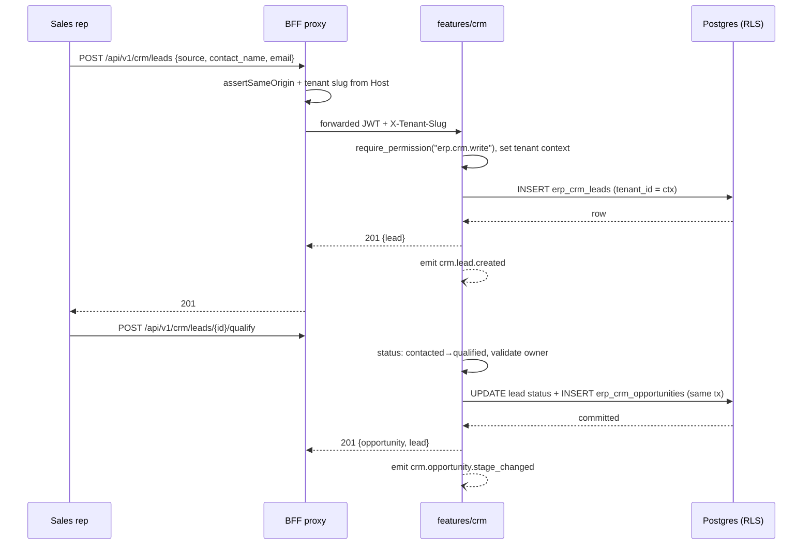
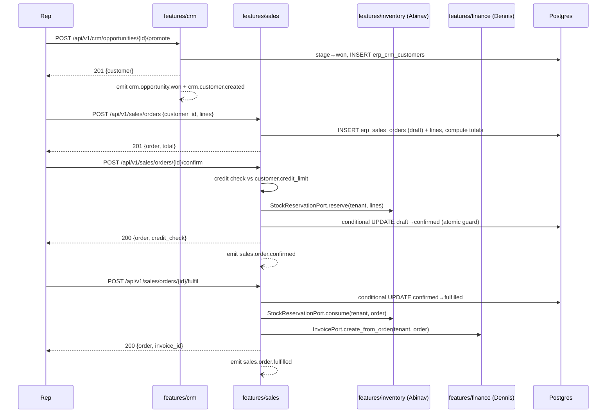

# Skyrict - Sales & CRM Module (ERP Phase 1)

## Status

Approved to build · **Module owner: Swalih** · Phase-1 ERP module track (`docs/architecture/erp-phase1.md`).

## Audience

The whole Skyrict team (Swalih - Sales & CRM, Abinav - Inventory & Warehouse, Abhikrishna - HR & Payroll, Dennis - Finance & Accounting). Each owner builds their module end-to-end (database, backend, frontend). This document is written so that **the other three owners can understand the Sales & CRM module** - its shape, its rules, and exactly where it contracts with their modules - without reading the implementation.

This module follows the **same architecture as the rest of Skyrict**. Nothing here invents a new convention: it mirrors `services/identity`'s feature-based layout, the existing BFF proxy + API client patterns in `apps/web`, the RLS tenancy model, the event envelope from `libs/skyrict-events`, and the RFC 7807 / permission conventions already in the repo.

---

## 1. Overview - Why this module exists, and what it does

### 1.1 Why

The Skyrict Business Operating System is built on the "internal truth" pillar: _"A deliberately scoped ERP slice - inventory, sales, cash, orders - capturing what's actually happening inside your company… the ~20% of operations that 80% of SMBs actually use"_ (`apps/web/src/config/index.ts`).

**Sales & CRM is the revenue-facing slice of that pillar.** It answers, in one tenant-scoped place:

- **Who** are we selling to, and where did they come from? (leads)
- **What** is in the pipeline, and is it moving? (opportunities → stages → won/lost)
- **Who** do we do business with, and on what terms? (customers)
- **What** did the customer actually commit to, in dollars? (sales orders)

It is deliberately **not** a full enterprise CRM. Phase 1 covers the single flow an SMB actually runs: capture a lead → qualify it into an opportunity → win it → convert to a customer → turn the win into an order → hand the order to inventory (reserve/fulfil stock) and finance (raise an invoice).

### 1.2 Position in the architecture

```
                ┌─────────────────────────────────────────────┐
                │              apps/web (workspace)            │
                │   dashboard/erp/crm/*  +  dashboard/erp/*    │
                └──────────────────┬──────────────────────────┘
                                   │ same-origin /api/v1/*  (BFF proxy)
                ┌──────────────────▼──────────────────────────┐
                │   services/core  (ERP - all Phase-1 modules) │
                │   features/crm     features/sales            │
                │   features/inventory (Abinav)   finance (Dennis) │
                │   features/hr (Abhikrishna)   reporting       │
                └───────┬────────────┬──────────────┬──────────┘
                        │            │              │
        services/identity (JWT,      │              │
        permissions, tenant)      Postgres 16 (RLS)  Redis (optional)
                                   │
                        libs/skyrict-{common,events}
```

Key architectural facts this module depends on:

- **Auth & tenancy are owned by `services/identity`.** Sales & CRM never mints tokens, never resolves tenants on its own. It trusts the verified JWT for identity (user id, tenant) and the tenant context set for the request; **permissions are resolved from the database at request time** - not from the JWT.
- **All Phase-1 ERP modules live in ONE service (`services/core`)** as sibling feature packages. Cross-module calls are in-process feature-to-feature calls through small **ports** (interfaces), so each owner stays in control of their own module's internals and the rest of the team codes against an interface, not someone else's tables.
- **Tenant isolation is enforced by PostgreSQL Row-Level Security**, plus a repository-layer `tenant_id` filter as defense in depth. Cross-tenant data access is impossible at the SQL level.
- **The browser never talks to the backend directly.** It goes through the same-origin BFF proxy (`apps/web/src/app/api/v1/[...path]/route.ts`) and the `apiFetch` client - exactly like identity does today.

### 1.3 Usage - who uses it, and the daily flows

| Actor                      | What they do in the module                                                                                                   |
| -------------------------- | ---------------------------------------------------------------------------------------------------------------------------- |
| Sales representative       | Creates leads, contacts them, qualifies into opportunities, moves stages, records wins/losses, creates customer orders       |
| Department manager         | Sees their team's pipeline and orders, approves order confirmation when credit limits are involved, reviews team performance |
| Organization admin / owner | Sees everything, sets payment terms / credit limits, manages customer records, reports                                       |

Daily flows (Phase 1):

1. **Lead capture** - a rep (or the owner) records a lead with a source (website, referral, call, social, event, partner, inbound).
2. **Qualification** - the rep contacts the lead and either qualifies it (→ creates an **opportunity** at the _prospecting_ stage) or disqualifies it (records the reason).
3. **Pipeline movement** - the opportunity moves _prospecting → qualified → proposal → negotiation_, then terminates at _won_ or _lost_ (with a lost reason). Each move emits an event.
4. **Customer creation** - a _won_ opportunity is promoted to a **customer** record (or a customer is created directly for an existing account).
5. **Ordering** - a rep drafts a **sales order** against a customer. Confirmation runs a credit check and **reserves stock** (contract with Abinav's inventory module). Fulfilment deducts stock and **creates an invoice** (contract with Dennis's finance module). Cancellation releases any reserved stock.
6. **Reporting** - the reporting module (M-RPT) consumes this module's events and tables for pipeline value, orders by period, and top customers.

---

## 2. System Design

### 2.1 Service placement and folder structure

Sales & CRM is built as **two feature packages in `services/core`**: `features/crm` (leads, opportunities, customers) and `features/sales` (sales orders). They are separated because they have different lifecycle rules and different permission families (`erp.crm.*` vs `erp.sales.*`), even though sales orders _reference_ CRM customers.

The service mirrors `services/identity`'s feature-based layout (this is the contract - follow it exactly, not the `_template` scaffold):

```
services/core/
├── src/core/
│   ├── api/
│   │   ├── deps.py              # shared: get_tenant_context, get_current_user, require_permission
│   │   ├── lifespan.py
│   │   ├── middleware.py
│   │   ├── readiness.py
│   │   └── v1/
│   │       ├── router.py        # mounts feature routers at /api/v1
│   │       └── health.py
│   ├── core/
│   │   ├── config.py            # CORE_* env settings
│   │   ├── constants.py         # enums, problem URIs, defaults
│   │   ├── exceptions.py        # RFC 7807 exceptions
│   │   ├── permissions.py       # erp.crm.* / erp.sales.* catalog for this service
│   │   ├── rate_limit.py
│   │   ├── security.py          # JWT verification (identity-issued)
│   │   ├── telemetry.py
│   │   ├── tenant_context.py    # request-scoped tenant ContextVar
│   │   └── tenant_resolver.py   # X-Tenant-Slug → tenant UUID
│   ├── db/
│   │   ├── base.py              # DeclarativeBase + RLS mixin
│   │   ├── session.py           # async engine/session factory
│   │   └── repository.py        # BaseRepository (tenant-scoped)
│   ├── domain/
│   │   ├── entities.py
│   │   └── value_objects.py     # Money, Quantity
│   ├── events/
│   │   ├── consumers/
│   │   ├── handlers/
│   │   └── producers/
│   │       ├── crm_events.py
│   │       └── sales_events.py
│   ├── features/
│   │   ├── crm/
│   │   │   ├── models/
│   │   │   │   ├── lead.py
│   │   │   │   ├── opportunity.py
│   │   │   │   └── customer.py
│   │   │   ├── router.py
│   │   │   ├── schemas.py
│   │   │   ├── service.py
│   │   │   ├── ports.py          # interfaces this feature needs from inventory/finance
│   │   │   └── repository.py
│   │   ├── sales/
│   │   │   ├── models/
│   │   │   │   ├── order.py
│   │   │   │   └── order_line.py
│   │   │   ├── router.py
│   │   │   ├── schemas.py
│   │   │   ├── service.py
│   │   │   ├── ports.py          # StockReservationPort, InvoicePort, CustomerPort
│   │   │   └── repository.py
│   │   ├── inventory/            # Abinav's module
│   │   ├── hr/                   # Abhikrishna's module
│   │   ├── finance/              # Dennis's module
│   │   └── reporting/
│   ├── cli.py
│   ├── main.py
│   └── seed.py                   # reference data (payment terms, sources, stages)
├── alembic/versions/             # 0001_initial … 0006_*, 0003_crm_sales (head)
├── tests/{unit,integration,factories}
├── Dockerfile
└── pyproject.toml
```

### 2.2 Layering contract (must hold)

```
api (router.py)  →  features/<module>/service.py  →  features/<module>/repository.py  →  models
                          │
                          └── events/producers  (emit after commit)
```

- Controllers (routers) are thin: parse request → call service → map to response schema.
- **Business rules live in the feature service.** Validation of money, state-machine transitions, credit checks, owner scoping - all here.
- **Repositories are the only code that touches SQLAlchemy models.** They own tenant scoping (`WHERE tenant_id = ctx.tenant_id`) and RLS-compatible queries.
- **No direct DB access from routers or event handlers.**
- Cross-feature calls go through `ports.py` interfaces (see §2.7), implemented by the owning feature. Services never import another feature's repository or models.
- Money is a domain value object (`Money(amount: Decimal, currency: str)`) - **never `float`**. Quantities are `Decimal`.

### 2.3 Multi-tenancy and RLS

Identical model to identity:

1. Every `erp_*` table carries `tenant_id UUID NOT NULL`.
2. Every table has RLS **enabled** and a policy:

```sql
ALTER TABLE erp_crm_leads ENABLE ROW LEVEL SECURITY;
CREATE POLICY erp_crm_leads_tenant_isolation ON erp_crm_leads
  USING (tenant_id = current_setting('app.current_tenant_id', true)::uuid);
```

3. The request pipeline sets the session variable once per request:

```
client → BFF proxy (Host → slug) → /api/v1/crm/* → core api/deps.py
   get_tenant_context(): resolve slug → tenant UUID via core/tenant_resolver.py
   → validate JWT membership (identity-issued token)
   → SET app.current_tenant_id = <tenant_id>  (on the request session)
   → stash tenant in the request-scoped ContextVar (core/tenant_context.py)
```

4. The repository layer additionally filters by the ContextVar tenant id. **RLS is the hard guarantee; the repository filter is defense in depth and makes queries correct even where RLS is not in force (tests, scripts).**
5. Cross-tenant data is **unreachable**: a query that tries to read another tenant's rows returns zero rows, never an error, and any multi-tenant write attempt is blocked by the policy.

**RLS + composite FKs (key sketch).** Sales-order lines must never join to a sales order of another tenant. All FK pairs between tenant-scoped tables include `tenant_id`:

```sql
CONSTRAINT erp_sales_order_lines_order_fk
  FOREIGN KEY (tenant_id, order_id)
  REFERENCES erp_sales_orders (tenant_id, id)
```

### 2.4 Authentication and authorization

- `services/core` verifies the **identity-issued access JWT** (RS256, shared `JWT_PUBLIC_KEY`, same issuer/audience). It never issues tokens.
- Permissions are **resolved from the database at request time** by a `require_permission("erp.crm.read")` dependency in `api/deps.py` - mirroring `services/identity/src/identity/api/deps.py:140`. That dependency loads the current user + their roles, then calls `AuthorizationService.require_permission(...)` against the DB-resolved grants. The JWT carries **no** `permissions` claim; role changes take effect immediately without re-login. Logging comes from `libs/skyrict-common` (`src/skyrict_common/logging.py`) - there is no separate `libs/skyrict-logging`.
- **Two permission families** (user-approved naming):

| Key                 | Meaning                                                               |
| ------------------- | --------------------------------------------------------------------- |
| `erp.crm.read`      | View leads, opportunities, customers                                  |
| `erp.crm.write`     | Create/edit leads, opportunities, customers; move stages              |
| `erp.sales.read`    | View sales orders                                                     |
| `erp.sales.write`   | Draft/edit sales orders                                               |
| `erp.sales.approve` | Confirm, fulfil, or cancel a sales order (side-effecting transitions) |

- **Where these keys are registered:** the platform-fixed catalog in `services/identity/src/identity/core/permissions.py`. The module docstring is explicit: _"A permission must be added here AND via migration before it can be assigned to roles."_ So the implementation step is:

```python
# services/identity/src/identity/core/permissions.py
ERP_CRM_READ = "erp.crm.read"
ERP_CRM_WRITE = "erp.crm.write"
ERP_SALES_READ = "erp.sales.read"
ERP_SALES_WRITE = "erp.sales.write"
ERP_SALES_APPROVE = "erp.sales.approve"

# add all five to CATALOG and to the ("erp", "ERP", (...)) PERMISSION_MODULES entry
```

Then update `core/constants.py` `SYSTEM_ROLE_DEFINITIONS` (this is the seeded role → permission mapping):

| Role                 | Sales & CRM grants (added to existing)                                                    |
| -------------------- | ----------------------------------------------------------------------------------------- |
| `tenant_owner`       | `*` (already full access)                                                                 |
| `organization_admin` | `erp.crm.read`, `erp.crm.write`, `erp.sales.read`, `erp.sales.write`, `erp.sales.approve` |
| `department_manager` | `erp.crm.read`, `erp.crm.write`, `erp.sales.read`, `erp.sales.write`                      |
| `standard_user`      | `erp.crm.read`, `erp.sales.read`                                                          |
| `auditor`            | `erp.crm.read`, `erp.sales.read`                                                          |

And add a migration in identity that inserts the five keys into the permissions table (mirroring the existing permission migration).

> **Team coordination:** the identity permission change is a shared dependency for all four modules. It should be one PR (or coordinated commits) so all five ERP permission families land together. Until then, the `core` service still works - it just rejects every ERP request with 403.

### 2.5 Events

Use `libs/skyrict-events` (`src/skyrict_events/base.py`). Every event is a `BaseEvent` subclass: `{event_id, event_type, timestamp, tenant_id, version, correlation_id, metadata}`, topic convention **`{domain}.{entity}.{action}`**, partition key = `tenant_id`.

**Phase-1 policy (from `erp-phase1.md`):** emit events after commit; Kafka stays optional in dev (`KAFKA_BROKERS` unset → producers no-op). Consumers in Phase 1 are in-process/outbox background jobs (e.g. reporting snapshot refresh).

Events this module emits:

| Topic                           | Emitted when           | Payload highlights                           | Consumer intent                |
| ------------------------------- | ---------------------- | -------------------------------------------- | ------------------------------ |
| `crm.lead.created`              | lead inserted          | lead_id, source, owner_id                    | Reporting                      |
| `crm.lead.status_changed`       | status transition      | lead_id, from_status, to_status              | Reporting, agent hooks         |
| `crm.opportunity.stage_changed` | stage transition       | opportunity_id, from_stage, to_stage, amount | Reporting, pipeline metrics    |
| `crm.opportunity.won`           | stage → won            | opportunity_id, amount, customer_id          | Reporting, finance context     |
| `crm.opportunity.lost`          | stage → lost           | opportunity_id, reason, amount               | Reporting                      |
| `crm.customer.created`          | customer inserted      | customer_id, name                            | Reporting                      |
| `sales.order.created`           | draft persisted        | order_id, order_number, customer_id, total   | Reporting                      |
| `sales.order.confirmed`         | confirmation committed | order_id, order_number, total, credit_check  | Inventory (reserve), reporting |
| `sales.order.fulfilled`         | fulfilment committed   | order_id, invoice_id                         | Finance, reporting             |
| `sales.order.cancelled`         | cancellation committed | order_id, reason                             | Inventory (release), reporting |

Producer sketch (follow `identity`'s `events/producers/invitation_events.py` style):

```python
# src/core/events/producers/sales_events.py
from skyrict_events import BaseEvent

class SalesOrderConfirmed(BaseEvent):
    event_type: str = "sales.order.confirmed"
    order_id: str
    order_number: str
    total: dict[str, str]   # {"amount": "1250.00", "currency": "USD"}
    credit_check: str
```

### 2.6 Errors, pagination, idempotency

- **Errors:** RFC 7807 `application/problem+json` via `core/exceptions.py` (mirrors identity). Problem URIs live in `core/constants.py` under `https://api.skyrict.io/problems/*`. Service raises domain exceptions; the API layer maps them to status codes.
- **Pagination:** offset/limit via `?page=&page_size=` (default `page=1`, `page_size=20`, max 100) - the platform convention from `libs/skyrict-common/src/skyrict_common/pagination.py` (`PaginationParams`). List responses use the standard envelope: `ListResponse(data=[...], meta=PaginationMeta(total, page, page_size, total_pages))` from `libs/skyrict-common/src/skyrict_common/schemas.py`. There is **no** cursor pagination.
- **Idempotency is probe-based + atomic state guards** (the platform convention - there is no `Idempotency-Key` header anywhere in the codebase). Side-effecting transitions (order confirm/fulfil/cancel) run a conditional UPDATE on the order status (`WHERE status = <expected>`); exactly one concurrent caller wins (rowcount 1), everyone else gets the current state. A replayed confirm of an already-confirmed order hits the state guard, reads the stored result, and returns it instead of double-executing. (Mechanism in §4.3.) An `Idempotency-Key` header is an optional future enhancement, not required.

### 2.7 Cross-module ports (the team contract)

All Phase-1 modules are in the same `services/core` process, but **no feature imports another feature's repository or models**. Instead:

```python
# src/core/features/sales/ports.py
class StockReservationPort(Protocol):
    """Implemented by features/inventory. Called at order confirmation/fulfilment."""
    async def reserve(self, tenant_id: UUID, lines: Sequence[LineReservation]) -> None: ...
    async def release(self, tenant_id: UUID, order_id: UUID) -> None: ...
    async def consume(self, tenant_id: UUID, order_id: UUID) -> None: ...

class InvoicePort(Protocol):
    """Implemented by features/finance. Called at order fulfilment."""
    async def create_from_order(self, tenant_id: UUID, order_id: UUID) -> UUID: ...
```

- The `sales` service takes these ports as constructor dependencies (`ServicePorts`), injected at composition root (`api/deps.py`) with the implementations owned by `features/inventory` and `features/finance`.
- **This is the contract with Abinav and Dennis:** they implement the two protocols (or approve the exact signatures) and register them; Swalih codes against the interface and integration-tests against their real implementations once they land, mocks before that.

---

## 3. Database Design

### 3.1 ERD

```mermaid
erDiagram
    ERP_CRM_LEADS ||..o| ERP_CRM_OPPORTUNITIES : "qualifies to (soft link, no FK)"
    ERP_CRM_OPPORTUNITIES }o..o| ERP_CRM_CUSTOMERS : "promotes to (service layer)"
    ERP_CRM_CUSTOMERS ||--o{ ERP_SALES_ORDERS : "places"
    ERP_SALES_ORDERS ||--|{ ERP_SALES_ORDER_LINES : "contains"
    ERP_SALES_ORDER_LINES }o--|| ERP_PRODUCTS : "hard composite FK (inventory module)"

    ERP_CRM_LEADS {
        uuid id PK
        uuid tenant_id FK
        string status "new|contacted|qualified|disqualified"
        string source "website|referral|cold_call|social|event|partner|inbound"
        string first_name
        string last_name
        string email
        string phone
        string company
        uuid owner_id "identity user, nullable"
        uuid team_id "soft UUID, nullable"
        timestamptz created_at
        timestamptz updated_at
    }
    ERP_CRM_OPPORTUNITIES {
        uuid id PK
        uuid tenant_id FK
        string name
        string stage "prospecting|qualified|proposal|negotiation|won|lost"
        decimal amount "nullable"
        string currency "required iff amount present"
        int probability "0..100"
        date expected_close_date
        uuid owner_id "identity user, nullable"
        uuid team_id "soft UUID, nullable"
        string lost_reason "nullable"
        timestamptz won_at "required iff stage=won"
        timestamptz lost_at "required iff stage=lost"
        timestamptz created_at
        timestamptz updated_at
    }
    ERP_CRM_CUSTOMERS {
        uuid id PK
        uuid tenant_id FK
        string customer_code "unique per tenant"
        string name
        string email
        string phone
        decimal credit_limit "nullable"
        string currency "required iff credit_limit present"
        boolean is_active "soft delete"
        timestamptz created_at
        timestamptz updated_at
    }
    ERP_SALES_ORDERS {
        uuid id PK
        uuid tenant_id FK
        string order_number "SO-2026-0001, unique per tenant"
        uuid customer_id FK "composite (tenant_id, customer_id)"
        string status "draft|confirmed|fulfilled|cancelled"
        string credit_check "pending|passed|failed"
        decimal subtotal
        decimal discount
        decimal tax
        decimal total
        string currency
        timestamptz confirmed_at "required iff status in (confirmed, fulfilled)"
        timestamptz created_at
        timestamptz updated_at
    }
    ERP_SALES_ORDER_LINES {
        uuid id PK
        uuid tenant_id FK
        uuid order_id FK "composite (tenant_id, order_id), CASCADE"
        uuid product_id FK "composite (tenant_id, product_id) -> erp_products, RESTRICT"
        string product_name "denormalized snapshot"
        string sku "denormalized snapshot"
        decimal quantity "> 0"
        decimal unit_price
        decimal discount
        decimal tax
        decimal line_total "cached projection"
        timestamptz created_at
    }
```



> **Note on `product_id`:** products are owned by Abinav's inventory module (`erp_products`). Unlike the original plan, sales order lines carry a **real hard composite FK** `(tenant_id, product_id) → erp_products(tenant_id, id)` ON DELETE RESTRICT (locked SKY-43 decision) - a line can never point at a cross-tenant or non-existent product at the constraint level. `product_name` / `sku` are denormalized snapshots so order history stays stable if the product catalog changes.

### 3.2 Table-by-table contract

All tables: `id UUID PRIMARY KEY`, `tenant_id UUID NOT NULL`, RLS enabled with a tenant policy, `created_at TIMESTAMPTZ NOT NULL DEFAULT now()` (and `updated_at` where mutable). All money columns are `NUMERIC(18, 4)`.

**`erp_crm_leads`** - inbound inquiries before they have pipeline value.

- `source` - enum: `website | referral | cold_call | social | event | partner | inbound`
- `status` - enum: `new | contacted | qualified | disqualified` (locked SKY-43: **no `converted`** - qualification creates an opportunity via the service, the lead keeps its own lifecycle)
- `first_name` / `last_name` / `email` / `phone` / `company` - at least one contact channel required (DB CHECK `ck_erp_crm_leads_contact_present`: a lead row is always identifiable)
- `owner_id UUID NULL` - identity user id; `team_id UUID NULL` - soft team reference (no FK; teams don't exist yet); `NULL` = unassigned
- `email` - **non-unique** `(tenant_id, email)` index (locked SKY-43); dedupe is a soft service-layer probe (`find_leads_by_email`), never a uniqueness constraint
- Indexes: `(tenant_id, email)`, `(tenant_id, owner_id)`

**`erp_crm_opportunities`** - pipeline deals.

- `stage` - enum: `prospecting | qualified | proposal | negotiation | won | lost`
- **Customer-less in Phase 1** (locked SKY-43): there is **no** `customer_id` FK and **no** `lead_id` FK - a won opportunity is promoted to a customer by the service layer (`source_opportunity_id` on the customer is optional and deferred to CRM-BE-002)
- `amount NUMERIC(18,4) NULL` + `currency` (Money) - DB CHECK: currency required iff amount present; amount must be >= 0
- `probability INTEGER 0..100` (DB CHECK `ck_erp_crm_opportunities_probability_range`)
- `won_at` / `lost_at` - DB CHECK `ck_erp_crm_opportunities_stage_outcome`: `won_at` required iff `stage='won'`, `lost_at` required iff `stage='lost'`, both forbidden together
- Indexes: `(tenant_id, stage)`, `(tenant_id, owner_id)`, `(tenant_id, team_id)`, `(tenant_id, expected_close_date)`

**`erp_crm_customers`** - accounts we do business with.

- `customer_code` - stable per-tenant external key; unique `(tenant_id, customer_code)`
- `credit_limit NUMERIC(18,4) NULL` + `currency` - DB CHECK: currency required iff a limit is present; `NULL` = no limit (credit check passes)
- `is_active BOOLEAN` - **soft delete** (locked SKY-43: no customer status enum); default `true`; `list_customers` hides inactive by default
- Indexes: `(tenant_id, name)`

**`erp_sales_orders`** - customer commitments; the money record handed to finance.

- `order_number` - `SO-{yyyy}-{seq}`, sequential per tenant; unique `(tenant_id, order_number)`
- `status` - enum: `draft | confirmed | fulfilled | cancelled` (state machine in §3.3)
- `customer_id` with **composite FK** `(tenant_id, customer_id) → erp_crm_customers(tenant_id, id)` ON DELETE RESTRICT (customers are soft-deleted, never hard-deleted)
- Money columns: `subtotal`, `discount`, `tax`, `total` (total = subtotal − discount + tax). The service recomputes totals from lines on every write (CRM-BE-002) - **the columns are a cached projection, never written by clients**; DB CHECK keeps them non-negative
- `credit_check` - enum: `pending | passed | failed`; result of the confirm-time check (default `pending`)
- `confirmed_at TIMESTAMPTZ NULL` - DB CHECK `ck_erp_sales_orders_status_confirmed_at`: present iff status is `confirmed` or `fulfilled`
- Orders have **no owner/team columns** (locked SKY-43) - tenant-scoped only; RLS bounds the tenant
- Indexes: `(tenant_id, status)`, `(tenant_id, customer_id)`

**`erp_sales_order_lines`** - line items of an order.

- `order_id` with **composite FK** `(tenant_id, order_id) → erp_sales_orders(tenant_id, id)` ON DELETE CASCADE
- `product_id` with **hard composite FK** `(tenant_id, product_id) → erp_products(tenant_id, id)` ON DELETE RESTRICT (see the note after the ERD)
- `product_name` / `sku` - denormalized snapshots taken at order time
- `quantity NUMERIC(18,4)` - DB CHECK `> 0`; `unit_price`, `discount`, `tax`, `line_total` (derived: `(unit_price − discount) × quantity`, cached projection) - all non-negative by DB CHECK
- Indexes: `(tenant_id, order_id)`

### 3.3 State machines

```
Lead:     new ──► contacted ──► qualified
                 └─────────────► disqualified

Opportunity:    prospecting ──► qualified ──► proposal ──► negotiation ──► won
                                                │                            │
                                                └────────────────────────────┘
                                                           └──► lost   (from any non-terminal stage)

Sales order:    draft ──► confirmed ──► fulfilled
                  │           │
                  └───────────┴──► cancelled   (from draft or confirmed only)
```

Transition rules:

- Lead: `qualified` / `disqualified` are reached from `new`/`contacted` via the service; qualification creates the opportunity in the same transaction. The DB enforces only the contact-channel CHECK - lifecycle rules live in the service (CRM-BE-002).
- Opportunity: only one transition per call; `won`/`lost` are terminal (a later update on a won deal changes fields but never the stage). The DB CHECK ties each terminal stage to its timestamp.
- Sales order: `confirm` only from `draft`; `fulfil` only from `confirmed`; `cancel` from `draft` or `confirmed` (a cancelled order's `confirmed_at` is cleared to satisfy the status CHECK). Fulfilling a cancelled order is impossible. **Guards are conditional SQL UPDATEs** (below), so two concurrent confirm requests cannot both succeed.

### 3.4 Migrations

Alembic under `services/core/alembic/`. Migration **`0003_crm_sales`** is the current head. It follows the repo's out-of-order numbering precedent (0004): revision `"0003"` with `down_revision = "0006"`, keeping a single linear chain `0001 → 0002 → 0005 → 0004 → 0006 → 0003`. Implemented:

1. Create the four native enum types: `erp_crm_lead_status`, `erp_crm_opportunity_stage`, `erp_sales_order_status`, `erp_sales_credit_check_result`.
2. Create `erp_crm_leads`, `erp_crm_opportunities`, `erp_crm_customers`, `erp_sales_orders`, `erp_sales_order_lines`.
3. Create composite-FK constraints (tenant-scoped), including the **hard FK to `erp_products`** on order lines.
4. Create indexes + the DB CHECKs listed in §3.2.
5. `ENABLE ROW LEVEL SECURITY` + create tenant-isolation policies on all five tables.
6. Seed the three new permission keys into `core_permissions`: `erp.crm.read`, `erp.crm.write`, `erp.sales.approve` (0001 already seeded `erp.sales.read/write`; 0006 seeded `erp.finance.*`). Idempotent `ON CONFLICT (key) DO NOTHING`.
7. Downgrade drops permission seeds, then policies, enums, and tables (reverse order).

Reference data (`src/core/seed.py`, no tenant data): lead sources, `SO-` numbering sequence start. Coordinate with Dennis: the `SO-` prefix constant lives in `core/constants.py` shared by the numbering service.

---

## 4. Flows

### 4.1 Lead capture and qualification



### 4.2 Win → customer → order → fulfil



### 4.3 Idempotent order confirmation (the tricky part - key sketch)

The dangerous failure mode: the client retries `confirm` after a timeout and the retry reserves stock twice or double-confirms. Two mechanisms close it:

1. **Atomic state guard.** The `draft → confirmed` transition is a conditional UPDATE, so the row flips exactly once:

```python
# features/sales/repository.py
async def confirm_order(self, order_id: UUID, *, tenant_id: UUID) -> int:
    """Returns 1 if the row was transitioned, 0 if it was already confirmed."""
    result = await self.session.execute(
        update(ErpSalesOrder)
        .where(
            ErpSalesOrder.tenant_id == tenant_id,
            ErpSalesOrder.id == order_id,
            ErpSalesOrder.status == "draft",   # the atomic guard
        )
        .values(status="confirmed", confirmed_at=func.now(), credit_check=self.credit_check)
    )
    return result.rowcount  # 1 → we own the side effects; 0 → already confirmed
```

2. **State-guard short-circuit on replay.** A confirm that **lost** the state guard (rowcount 0) checks the current order status: if it is already `confirmed` with a stored result (credit check, reserved stock, emitted event), it returns that stored result with 200 instead of erroring - no stock is reserved again. The endpoint is safe under retry by design, with no `Idempotency-Key` header needed.

Order of operations on confirm (all-or-nothing): **state guard → credit check → stock reserve → respond.** If stock reservation fails, the transaction rolls back (order stays `draft`), the client gets a 409 `problem+json` "insufficient stock", and a retry is legal.

### 4.4 Owner and team scoping

Implemented in `core/db/rbac.py` - the ONE place a role name becomes a row-scoping rule:

- `standard_user` sees only rows where `owner_id = current_user` (**OWNER scope**).
- `department_manager` sees rows where `owner_id = current_user` **OR** `team_id = current_user's team` (**TEAM scope**).
- `organization_admin` / `tenant_owner` / `owner` / `auditor` see all rows (**ALL scope**).
- Unknown roles **fail closed** to OWNER - a user can never see MORE than their role grants. When a user holds several roles, the highest scope wins (merged per request).
- **Unassigned rows** (owner_id AND team_id NULL) are visible only to ALL scope - a deliberate strict default.

Scope is resolved once per request in `api/deps.py` via `RbacRepository.resolve_user_scope(...) -> (DataScope, team_id)` and passed to the repository - the repository never sees a role name:

```python
# features/crm/repository.py (implemented - no hardcoded role names)
def _scope_filter(*, scope: DataScope, owner, team, user_id, team_id) -> ColumnElement[bool] | None:
    if scope == DataScope.OWNER:
        if user_id is None:
            return false()                 # no user -> no rows (fail closed)
        return owner == user_id
    if scope == DataScope.TEAM:
        predicates = []
        if user_id is not None:
            predicates.append(owner == user_id)
        if team_id is not None:
            predicates.append(team == team_id)
        if not predicates:
            return false()                 # neither id -> no rows (fail closed)
        return or_(*predicates)
    return None                            # ALL -> tenant filter only (RLS bounds the tenant)
```

**Enforcement is server-side in the repository.** The frontend may hide rows, but it can never broaden them. Customers and sales orders have no owner/team columns - they are tenant-scoped only (locked SKY-43 decision).

---

## 5. Backend Implementation Guide

Step-by-step. Each step lists the file, its responsibility, and the acceptance point.

### Step 1 - Service skeleton (coordinate with the other three owners)

`services/core` scaffolded from the identity layout (tree in §2.1), registered in the uv workspace, added to docker-compose. Verify: `uv run ruff check services/core`, pytest green with an empty-suite placeholder, `/api/v1/health` responds. (Shared step - one PR from whichever owner lands first, or agreed split.)

### Step 2 - Core wiring (shared, but this module's dependency)

- `core/config.py` - `CORE_` settings: `DATABASE_URL`, `JWT_PUBLIC_KEY`, `JWT_ISSUER`, `REDIS_URL`, `DEFAULT_CURRENCY=USD`, `SALES_ORDER_PREFIX="SO"`.
- `core/security.py` - decode + verify identity JWT (RS256, issuer/audience check), extract `permissions`, `sub`, `sid`.
- `core/tenant_resolver.py` + `core/tenant_context.py` - slug → tenant UUID; ContextVar. (Reuse identity's implementation shape; identity stays the tenant source of truth - `core` may cache the slug→UUID mapping in Redis with a short TTL.)
- `api/deps.py` - `get_tenant_context`, `get_current_user`, `require_permission(...)` (resolves permissions from the DB at request time).
- `db/base.py` - `DeclarativeBase` + `TenantScopedMixin` (`tenant_id` column + `update_tenant_id` RLS-helper).
- `core/permissions.py` - this service's catalog constants (`ERP_CRM_READ` etc.) for readability; enforcement data still comes from the JWT.

Verify: a `require_permission("erp.crm.read")` protected endpoint returns 401 without token, 403 without the permission, 200 with it.

### Step 3 - Models + migration

Write the five models in `features/{crm,sales}/models/` per §2.1. Then `alembic revision` → `0003_crm_sales` implementing §3.4. **Verify the hard part:** run two-tenant integration assertions (below) against the migration - RLS policies must block cross-tenant writes and silently filter cross-tenant reads.

### Step 4 - CRM feature

- `features/crm/schemas.py` - Pydantic request/response: `LeadCreate/Update/Out`, `OpportunityCreate/Update/Out`, `CustomerCreate/Update/Out`; list envelopes; enums.
- `features/crm/repository.py` - tenant-filtered CRUD + scope filter (§4.4) + the atomic `qualify` (update lead + insert opportunity in one transaction).
- `features/crm/service.py` - rules: lead dedupe soft-check, qualification creates the opportunity, stage transitions, promote (won → customer), terminal-stage immutability, events after commit.
- `features/crm/router.py` - endpoints (see §6); dependencies: `require_permission("erp.crm.read")` on reads, `.write` on writes.
- `features/crm/ports.py` - `IdentityUserPort` (validate `owner_id` belongs to the tenant) - implemented against identity's public API via a small client, since identity owns users.

### Step 5 - Sales feature

- `features/sales/schemas.py` - `SalesOrderCreate/Out`, `SalesOrderLineIn/Out`, `OrderConfirmOut`, list envelope.
- `features/sales/repository.py` - order + lines (one transaction), the conditional state transitions (§4.3), numbering (`SO-{year}-{seq}` inside the same transaction, unique `(tenant_id, order_number)`).
- `features/sales/service.py` - recompute totals from lines (never trust client math), credit check, orchestrate confirm/fulfil/cancel against the ports, events after commit.
- `features/sales/ports.py` - `StockReservationPort`, `InvoicePort`, `CustomerPort` (read customer + credit limit).
- `features/sales/router.py` - endpoints (§6).
- **Composition:** `api/deps.py` injects real implementations of `StockReservationPort` (from `features/inventory`) and `InvoicePort` (from `features/finance`). Until those modules land, inject **test doubles** behind the same interface so this module is buildable in parallel.

### Step 6 - Events

`events/producers/crm_events.py` + `sales_events.py` per §2.5. Emit **after commit** (subscribe to the session's "committed" hook or emit in the service after repository commit returns). `correlation_id` flows from the request id / a client-generated `X-Request-Id`.

### Step 7 - Tests

```
services/core/tests/
├── unit/features/test_crm_service.py      # qualification, stages, promote, terminal immutability
├── unit/features/test_sales_service.py    # totals recompute, credit check, state guards, events
├── unit/core/test_permissions.py          # DB-resolved require_permission (mirrors identity)
├── integration/api/test_crm_api.py        # full CRUD + stage moves over HTTP
├── integration/api/test_sales_orders_api.py  # confirm/fulfil/cancel, idempotency replay
├── integration/api/test_tenant_isolation.py  # two tenants, RLS assertions
└── factories/crm_factories.py             # factory-boy builders for the five models
```

The **two-tenant isolation test is the module's security test**:

```python
# integration/api/test_tenant_isolation.py (shape)
async def test_cross_tenant_read_is_empty(client_a, client_b):
    # tenant A creates a customer; tenant B lists customers
    b_leads = await client_b.get("/api/v1/crm/leads")
    assert b_leads.json()["items"] == []

async def test_cross_tenant_write_is_blocked(client_a, client_b, customer_a):
    resp = await client_b.post(
        "/api/v1/sales/orders",
        json={"customer_id": customer_a["id"], "lines": [...]},
    )
    assert resp.status_code == 404  # customer not visible to B → not found, no info leak
```

---

## 6. API Reference

Base path `/api/v1`. Every endpoint: requires valid identity access JWT + tenant context; errors are RFC 7807; lists are offset/limit paginated (`?page=&page_size=`, envelope `ListResponse`). `✓` = side-effecting, must pass the BFF Origin/CSRF gate; transitions are idempotent via atomic state guards.

### CRM

| Method | Path                                       | Permission      | Notes                                                |
| ------ | ------------------------------------------ | --------------- | ---------------------------------------------------- |
| GET    | `/api/v1/crm/leads`                        | `erp.crm.read`  | filters: `status`, `source`, `owner_id`, `q`         |
| POST   | `/api/v1/crm/leads` ✓                      | `erp.crm.write` | soft dedupe on email                                 |
| GET    | `/api/v1/crm/leads/{id}`                   | `erp.crm.read`  | 404 if out of scope                                  |
| PATCH  | `/api/v1/crm/leads/{id}`                   | `erp.crm.write` |                                                      |
| POST   | `/api/v1/crm/leads/{id}/qualify` ✓         | `erp.crm.write` | status→qualified + creates opportunity (atomic)      |
| POST   | `/api/v1/crm/leads/{id}/disqualify` ✓      | `erp.crm.write` | body: `reason`                                       |
| GET    | `/api/v1/crm/opportunities`                | `erp.crm.read`  | filters: `stage`, `owner_id`, `from`/`to` close date |
| POST   | `/api/v1/crm/opportunities` ✓              | `erp.crm.write` |                                                      |
| GET    | `/api/v1/crm/opportunities/{id}`           | `erp.crm.read`  |                                                      |
| PATCH  | `/api/v1/crm/opportunities/{id}`           | `erp.crm.write` | cannot change stage here                             |
| POST   | `/api/v1/crm/opportunities/{id}/stage` ✓   | `erp.crm.write` | body: `to_stage`, `lost_reason?`                     |
| POST   | `/api/v1/crm/opportunities/{id}/promote` ✓ | `erp.crm.write` | stage→won, creates customer; returns `{customer_id}` |
| GET    | `/api/v1/crm/customers`                    | `erp.crm.read`  | filters: `status`, `q`                               |
| POST   | `/api/v1/crm/customers` ✓                  | `erp.crm.write` |                                                      |
| GET    | `/api/v1/crm/customers/{id}`               | `erp.crm.read`  |                                                      |
| PATCH  | `/api/v1/crm/customers/{id}`               | `erp.crm.write` |                                                      |

### Sales

| Method | Path                                  | Permission          | Notes                                                                           |
| ------ | ------------------------------------- | ------------------- | ------------------------------------------------------------------------------- |
| GET    | `/api/v1/sales/orders`                | `erp.sales.read`    | filters: `status`, `customer_id`, `owner_id`, `from`/`to` order date            |
| POST   | `/api/v1/sales/orders` ✓              | `erp.sales.write`   | creates draft; totals recomputed server-side                                    |
| GET    | `/api/v1/sales/orders/{id}`           | `erp.sales.read`    | includes lines + totals                                                         |
| PATCH  | `/api/v1/sales/orders/{id}`           | `erp.sales.write`   | draft only; edit lines/customer/ship date                                       |
| POST   | `/api/v1/sales/orders/{id}/confirm` ✓ | `erp.sales.approve` | idempotent; credit check + stock reserve; returns `{order, credit_check}`       |
| POST   | `/api/v1/sales/orders/{id}/fulfil` ✓  | `erp.sales.approve` | confirmed only; consumes stock + creates invoice; returns `{order, invoice_id}` |
| POST   | `/api/v1/sales/orders/{id}/cancel` ✓  | `erp.sales.approve` | body: `reason`; releases reserved stock                                         |

### Error cases

| Condition                                      | Status | Problem                                   |
| ---------------------------------------------- | ------ | ----------------------------------------- |
| Missing/invalid JWT                            | 401    | `authentication-error`                    |
| Valid JWT, missing permission                  | 403    | `authorization-error`                     |
| Unknown/other-tenant resource                  | 404    | `crm-not-found` / `sales-order-not-found` |
| Illegal transition (confirm a fulfilled order) | 409    | `illegal-state-transition`                |
| Credit limit exceeded on confirm               | 422    | `credit-limit-exceeded`                   |
| Insufficient stock on confirm                  | 409    | `insufficient-stock`                      |
| Replayed confirm (order already `confirmed`)   | 200    | stored result - no double reservation     |
| Rate limit                                     | 429    | `rate-limit-exceeded`                     |

---

## 7. Frontend Integration

The workspace already has the full pattern; this module adds to it and changes nothing fundamental.

### 7.1 BFF proxy routing (the one shared change)

The generic proxy `apps/web/src/app/api/v1/[...path]/route.ts` forwards every `/api/v1/*` call to identity via `callBackend` (which targets `API_PROXY_TARGET`). With `services/core` on its own port, the proxy must **route by first path segment**:

```ts
// apps/web/src/lib/server/auth.ts (add a second target + param)
const CORE_SEGMENTS = new Set([
    "crm",
    "sales",
    "inventory",
    "hr",
    "finance",
    "reporting",
]);

function routeTarget(path: string): string {
    const first = path.replace(/^\//, "").split("/")[0] ?? "";
    return CORE_SEGMENTS.has(first)
        ? (process.env.CORE_PROXY_TARGET ?? "http://localhost:8001")
        : apiBase();
}

export async function callBackend(
    path,
    { target = routeTarget(path), ...options } = {},
) {
    // fetch(`${target}/api/v1${path}`, ...)   // instead of apiBase()
}
```

Then in `[...path]/route.ts`, replace the hardcoded `callBackend(path, …)` - nothing else changes: same `assertSameOrigin` gate for state-changing methods, same `resolveTenantSlug` from Host (client `X-Tenant-Slug` stays ignored), same `no-store` discipline, same 502 message (parameterized: "ERP service is unavailable").

> **Team coordination:** this one-route change is shared by all four modules. Keep the `CORE_SEGMENTS` set in one place and agree the segment names now (`crm`, `sales`, `inventory`, `hr`, `finance`, `reporting`).

### 7.2 API client

New `apps/web/src/lib/api/crm-api.ts`, modeled exactly on `identity-api.ts`: typed payload interfaces, `mapX` mappers, thin `apiFetch`/`apiPost` calls. Nothing calls the backend directly.

```ts
// shape (mirror identity-api.ts)
export interface LeadOut {
    id: string;
    source: string;
    status: string;
    companyName?: string;
    contactName: string;
    email?: string;
    ownerId?: string;
    createdAt: string;
}
export interface ListLeadsParams {
    status?: string;
    ownerId?: string;
    page?: number;
    pageSize?: number;
}

export async function listLeads(
    params: ListLeadsParams = {},
): Promise<ListResponse<LeadOut>> {
    const qs = new URLSearchParams(
        Object.entries(params).filter(([, v]) => v != null),
    ).toString();
    return apiFetch(`/api/v1/crm/leads${qs ? `?${qs}` : ""}`);
}
export async function confirmOrder(
    orderId: string,
): Promise<OrderConfirmedOut> {
    return apiFetch(`/api/v1/sales/orders/${orderId}/confirm`, {
        method: "POST",
        body: JSON.stringify({}),
    });
}
```

The single-flight 401 → silent refresh in `lib/api/http.ts` works unchanged because the paths are still same-origin `/api/v1/*`.

### 7.3 Pages and UI

Routes under `apps/web/src/app/dashboard/erp/` (the existing ERP placeholder at `dashboard/erp/page.tsx` becomes a module landing page):

| Route                              | Page           | Key UI                                                                     |
| ---------------------------------- | -------------- | -------------------------------------------------------------------------- |
| `/dashboard/erp`                   | Module landing | Cards linking to each section; summary chips (pipeline value, open orders) |
| `/dashboard/erp/crm/leads`         | Leads          | Filterable table, create/qualify/disqualify actions                        |
| `/dashboard/erp/crm/opportunities` | Opportunities  | Pipeline **board** (columns per stage), move/deal actions, won/lost        |
| `/dashboard/erp/crm/customers`     | Customers      | Table, customer detail with order history                                  |
| `/dashboard/erp/orders`            | Sales orders   | Orders table (status filter), order detail, confirm/fulfil/cancel actions  |

Component conventions (follow the existing code):

- Server components render the shell + `PageHeader` (`@/components/dashboard/shared/page-header`); client components ("use client") do data fetching with `useSession()` + the `crm-api` client.
- Mutations: optimistic UI + `ApiError` (from `lib/api/http`) surface as inline/toast errors; retries are safe because transitions are state-guarded (a timed-out confirm can be re-issued as-is).
- Status badges, empty states, and skeletons - reuse `@/components/ui/*` (shadcn), no bespoke styling.
- **Permission gating is UI-only here** (sidebar + route guards hide what the user can't see); the real gate is the backend `require_permission`.

### 7.4 Sidebar

`apps/web/src/components/dashboard/workspace/app-sidebar.tsx` renders the nav from `sidebar-config.ts` (`erpNavGroups`). Expose the ERP sections there, filtered by the session's permissions (`useModuleAccess()` → `getMyRoles()` → `/api/v1/roles/me`):

- _CRM_ → shown when `permissions` contains `erp.crm.read`
- _Orders_ → shown when `erp.sales.read`
- (Inventory / HR / Finance groups appear when their modules land - one shared section, one code path, five permission filters.)

### 7.5 Plan gating

Visibility for a tenant = **permissions (JWT) ∩ enabled modules (billing)**. When billing lands (SKY-32..36), the BFF adds `enabled_modules` to the workspace session payload; the sidebar and route guards AND it with the permission check. Until then, `enabled_modules` is treated as "all Phase-1 modules" so development isn't blocked.

### 7.6 Frontend tests

- `tsc --noEmit`, `eslint`, `next build` must pass (the repo's existing web checks).
- Manual E2E script (two tenants): with two tenant subdomains (e.g. `tester.localhost` and a second seeded tenant), create lead → qualify → win → promote → order → confirm → fulfil on tenant A, and assert tenant B sees **no** leads/orders (isolation visible to the user).

---

## 8. Testing & Verification

### Backend

```
cd services/core
uv run ruff check src tests
uv run pyright src                      # or the repo's chosen typechecker
uv run pytest                           # unit + integration (RLS-enabled Postgres)
```

Verification checklist before review:

- [ ] Lead qualify creates exactly one opportunity, atomically
- [ ] Opportunity `won`/`lost` are terminal; subsequent stage moves rejected
- [ ] Order totals recomputed server-side; a tampered `total` in the request body is ignored
- [ ] Confirm is idempotent: replaying confirm on an already-`confirmed` order → 200 with stored result, no double stock reservation; concurrent confirms → one state guard wins
- [ ] Credit check: order over `credit_limit` → 422, stays `draft`; no limit → `not_required`
- [ ] Stock reservation failure → 409, order stays `draft`, retry legal
- [ ] Fulfil → one invoice via `InvoicePort`, `sales.order.fulfilled` emitted once
- [ ] Cancel (confirmed) releases reserved stock via `StockReservationPort`
- [ ] Owner scope: `standard_user` sees own rows only; `department_manager` sees team; `organization_admin`/`auditor` see all
- [ ] Two-tenant isolation: reads empty across tenants, cross-tenant writes → 404 (no info leak)
- [ ] Events emitted only after commit (failed transaction → no event)

### Frontend

- [ ] `pnpm tsc`, `pnpm lint`, `pnpm build` green
- [ ] Manual E2E across the two tenants (isolation visible in UI)

---

## 9. Definition of Done

1. `services/core` builds, lints, typechecks, and tests pass (unit + integration + two-tenant isolation).
2. Migration `0003_crm_sales` applies cleanly up and down (downgrade round-trip verified); RLS verified by the isolation tests.
3. Identity permission keys `erp.crm.*` + `erp.sales.*` catalogued, migrated, and seeded to roles; 403 behavior verified for a user without them.
4. All endpoints in §6 live, documented in OpenAPI, and covered by integration tests.
5. BFF routes `crm/*` and `sales/*` to `services/core`; `crm-api.ts` client ships the workspace pages; sidebar gates on permissions.
6. Events emitted per §2.5; reporting module can consume them (schema agreed with M-RPT owner).
7. Ports (`StockReservationPort`, `InvoicePort`) agreed with Abinav/Dennis and stubbed with test doubles until their real implementations land.
8. This document's acceptance checklist (§8) passes.

---

## 10. Future (explicitly out of Phase 1)

- Quoting/proposals as their own entity (opportunity attachments, PDF generation)
- Recurring orders / subscription terms on customers
- Payment links and online checkout on orders (feeds `finance`)
- Pipeline forecasting from `expected_close_date × stage probability`
- Team model (so `department_manager` scope is real, not all-users)
- Agent hooks: an AI agent reacting to `crm.opportunity.won` / `sales.order.fulfilled` (the "agent layer" pillar)

---

## 11. Related

- `docs/architecture/erp-phase1.md` - parent architecture (all five modules, shared RLS/events/permissions/ports policy)
- `docs/architecture/auth-production-model.md` - BFF discipline, `no-store`, CSRF gate, host allowlist
- `services/identity/src/identity/` - feature-based layout reference; `core/permissions.py` + `core/constants.py` (permission + role seed to extend)
- `apps/web/src/app/api/v1/[...path]/route.ts`, `apps/web/src/lib/server/auth.ts`, `apps/web/src/lib/api/{http,identity-api}.ts` - BFF/client patterns to extend
- `libs/skyrict-events/src/skyrict_events/base.py` - event envelope
- `docs/architecture/adr/001-use-uv-workspaces.md`, `002-single-identity-service.md`, `003-staging-wildcard-dns-tls.md`, `004-login-security-posture.md`
- Jira: SKY-30/31 (identity), SKY-32..36 (billing gating), ERP Phase-1 track (SKY-40+)

## Module owner contract

- **Swalih** owns `features/crm`, `features/sales`, the five tables, the two event families, and the workspace CRM/Orders UI end-to-end.
- **Abinav** owns `features/inventory` and implements `StockReservationPort` (`reserve` / `release` / `consume`).
- **Dennis** owns `features/finance` and implements `InvoicePort.create_from_order`.
- **Abhikrishna** owns `features/hr`; shares the same `core/` wiring and BFF routing change.
- Shared first PRs (before module work): `services/core` skeleton + RLS base + `api/deps.py`; identity permission catalog additions; the BFF routing change in §7.1.
